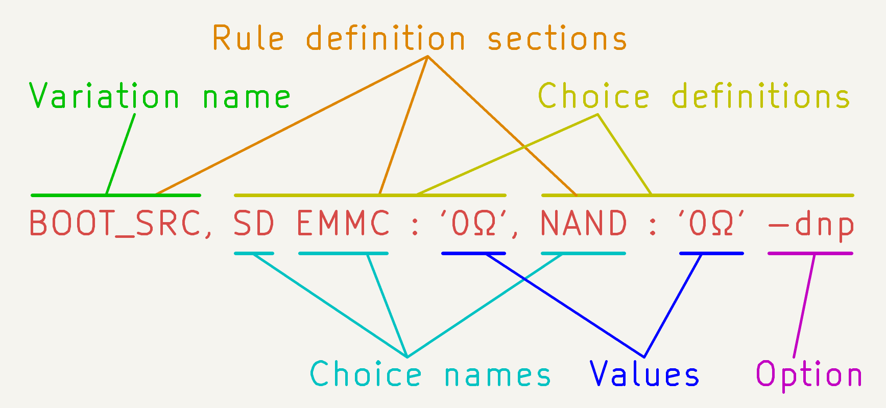
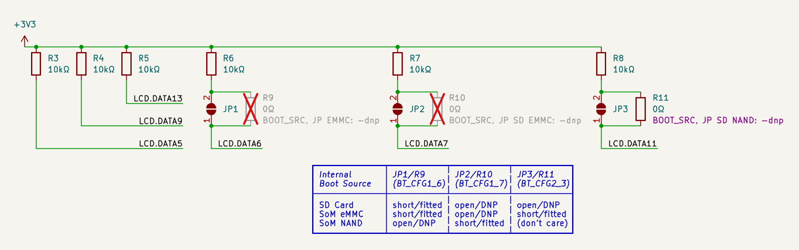
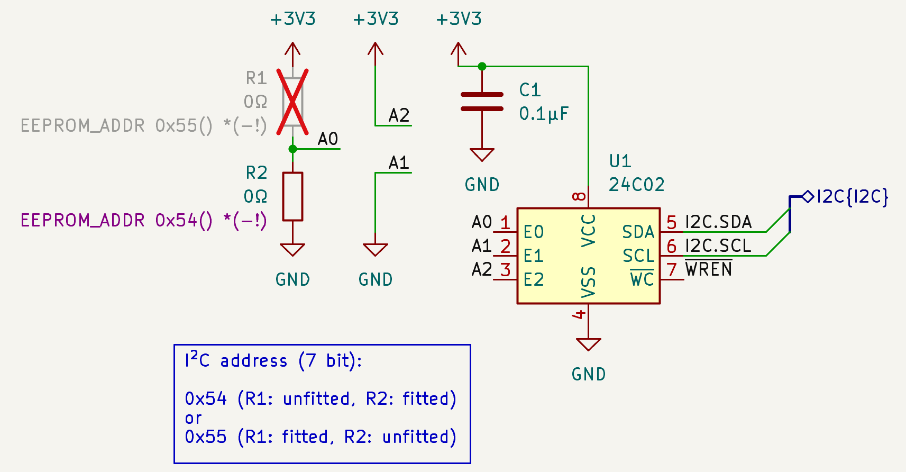
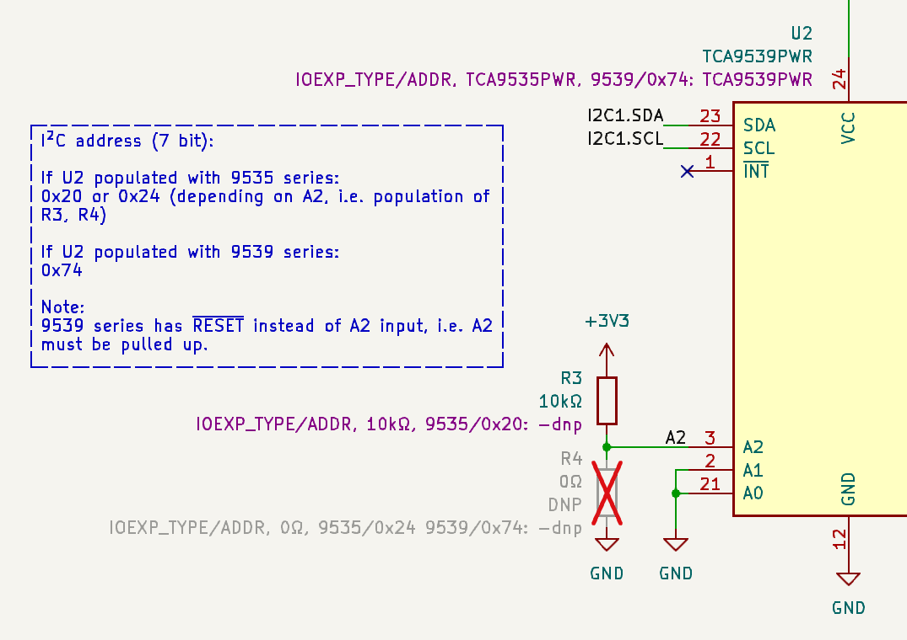
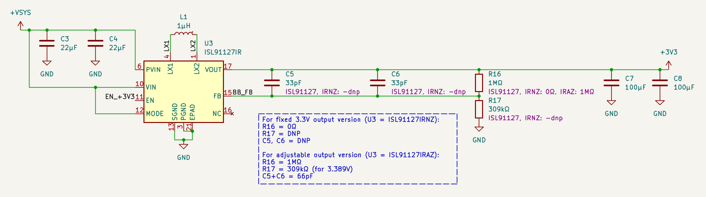
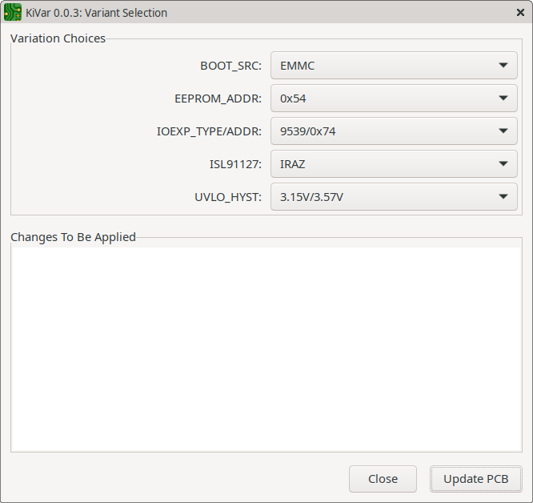
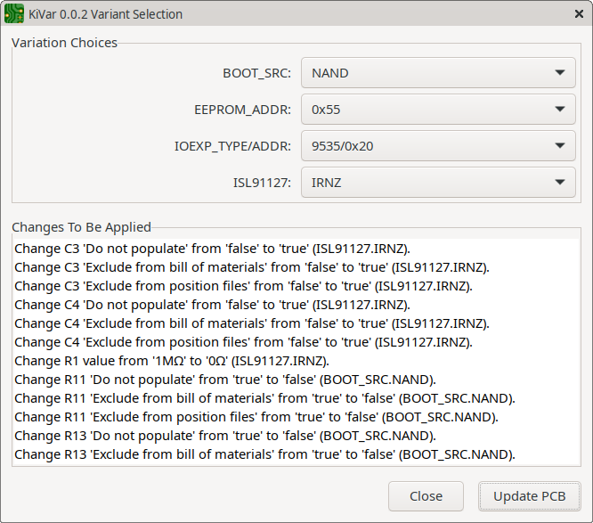

# KiVar

## Introduction

**KiVar is a KiCad Action Plugin providing PCB assembly variant selection.**

Component variations are defined by rules managed in dedicated symbol (or footprint) user fields.  This allows for the complete variation configuration to be contained in the schematic (or board) file without requiring external data from outside the native KiCad design files.

The plugin name _KiVar_ may be read as an acronym for _**Ki**Cad **V**ariation **a**ssignment **r**ules_.

## Features

KiVar assigns component **values** and **attributes** (such as _Do not populate_), depending on variation rules specified in symbol/footprint fields.  Component values and attributes are modified _in place_, allowing for immediate update of the PCB design as well as the 3D view and enabling compatibility with _any_ exporter.

Back-propagation of modified component data to the schematic can be done in an extra step.

## Supported KiCad Versions

Basic feature and API support is already provided by stable KiCad 7 releases, but the full potential of the plugin will be unleashed with the release of KiCad 8 (for the brave: 7.99 nightlies starting from around August 8th 2023 already fulfill all critical requirements).

The following table provides a feature support overview.

|Feature                                             |Stable KiCad 7.x|KiCad 7.99\* and later|
|----------------------------------------------------|----------------|----------------------|
|Edit variation rule definitions in symbols          |**Yes**         |**Yes**               |
|Edit variation rule definitions in footprints       |No              |**Yes**               |
|Apply value and DNP variation choices in PCB        |**Yes**         |**Yes**               |
|Apply footprint attribute "Do not populate"         |No              |**Yes**               |
|Apply footprint attribute "Exclude from BoM"        |**Yes**         |**Yes**               |
|Apply footprint attribute "Exclude from Pos Files"  |**Yes**         |**Yes**               |
|Update schematic symbol values from PCB             |**Yes**         |**Yes**               |
|Update schematic symbol attribute "DNP" from PCB    |No              |**Yes**               |
|Update schematic variation definitions from PCB     |No              |**Yes**               |

_\* Nightlies of August 8th 2023 and later._

## Concepts

The key concepts of KiVar are:

 * Support for **multiple** independent variation aspects per design.
 * Depending on the selected variation choices, component values and attributes are modified **in place**, allowing exporters to work on the actual component data.
 * Start and operation of the variant selection process **integrates seamlessly** into KiCad and gives the impression of a native feature.
 * Variation rules use a simple 'readable' syntax and are **fully contained** in symbol and/or footprint\* fields (i.e., zero configuration outside the native design files).

_\* Stable KiCad 7 does not yet support user-configurable footprint fields._

## Installation

1. Open the KiCad PCB Editor (pcbnew).
2. In the PCB Editor, choose the menu option _Tools &rarr; External Plugins &rarr; Open Plugin Directory_.  This will open a file browser at the location of your KiCad plugin directory.
3. Either copy all files from _this repository's_ sub-directory `plugin`, or unzip the contents of a KiVar release archive to that KiCad plugin directory you opened in the previous step.  _Important:_ If you use the _plugin_ directory, do not copy the directory itself, but only the files inside it.
4. Switch back to the PCB Editor and choose the menu option _Tools &rarr; External Plugins &rarr; Refresh Plugins_.  Now _KiVar_ should appear in the plugin list under _Tools &rarr; External Plugins_.
5. _Optional:_ For quick access, add the KiVar launcher button to your main toolbar under _Preferences &rarr; Preferences... &rarr; PCB Editor &rarr; Action Plugins_ by clicking the corresponding checkbox in the _Show button_ column.

If the installation does not work for you this way, consider reporting your problem as an issue.

## Usage

The process of writing and assigning rules to components (symbols/footprints) is done manually using simple expressions.

KiVar then offers the selection of variation choices providing an easy-to-use dialog interface and takes care of the automatic assignment of the specified component values and attributes.

The following sections describe the process of configuring your schematic or board and, after that, selecting the configured variation choices.

### Symbol Variation Setup

The following sections describe the variation setup procedure.

For stable _KiCad 7 releases_, setting up the variation configuration must be done in the _schematic_ and then propagated to the board, on which the plugin operates on.  Setting up the variation configuration directly in the board is not possible with KiCad 7, as these versions do not yet support footprint fields, but instead one-way-copy symbol fields to footprint _properties_, which are not exposed to the user interface in an editable way (but the data is there and is accessed by KiVar).

For _KiCad 7.99 and later_\*, it's up to the user to either edit the _schematic or board_ to setup the variation configuration, as footprint fields are implemented there and synchronizing them between schematic symbols and board footprints is supported.

No matter which KiCad version is used, being a _pcbnew_ Action Plugin, KiVar always uses the part data found in the currently opened _board_.  So all relevant symbol modifications _must be updated from the schematic to the board_ before using the plugin (described below in more detail).

_\* Nightlies of August 8th 2023 and later._

#### Definition of Terms

As mentioned before, KiVar supports multiple independent _variation aspects_ per board.  For each of these variation aspects, one _variation choice_ can be made later during the selection process.  The result of selecting a specific set of choices for a given set of variations forms a _variation configuration_.

Terms used in this document:

 * **Variation (or _Variation Aspect_):**
   A parameter which can be assigned one (out of _N_) specific argument, called a _(Variation) Choice_.
 
 * **Choice (or _Variation Choice_):**
   A specific argument for a Variation that is associated with a value and/or attributes definition for a specific board component (symbol/footprint).

 * **Configuration (or _Variation Configuration_):**
   The combination of a specific set of Choices for all available Variations.  In other words: The resulting board state after applying a fully defined set of Variations.

#### Variation Rules

Each variation rule is defined in field `KiVar.Rule` (case-sensitive field name) of the symbol (or footprint) it relates to.  Multiple symbols (or footprints) may refer to the same variations and choices.

Each time a variation is specified for any symbol, that variation is created or extended in the internal database.  Same applies to variation choices.

The syntax of such rules is described in the following sections.

_Hint:_ It is highly recommended to add `KiVar.Rule` as a project field name template (configure under _File &rarr; Schematic Setup... &rarr; General &rarr; Field Name Templates_), so that rules can easily be entered without manually adding the field to each respective symbol.

##### Definition Syntax

_Warning: Before KiVar 1.0 release, the definition syntax may change. Stay tuned for updates!_

The following sections provide an abstract specification of the rule definition syntax, including explanations based on the following rule example for illustration purposes.

_Example context:_ Symbol (or footprint) with reference `R1` has a field `KiVar.Rule` containing the following value:

`BOOT_SRC, SD EMMC : '0Ω', NAND : '0Ω' -dnp`

The following figure summarises the composition of a rule definition.  Each section of it is explained in more detail in the following sections. 

###### Rule Definition

A **rule definition** consists of a list of _comma_-separated sections.

The **first** section of each rule definition is special, as it contains the **variation name**.  **Any remaining** sections contain **choice definitions**, which relate to the variation name specified in the first section.

For the above example, `BOOT_SRC` is the variation name, and the variation choice definitions _for that variation_ are defined as:

 * `SD EMMC : '0Ω'` and
 * `NAND : '0Ω' -dnp`

###### Choice Definition

A choice definition normally (except for default choices, see below) consists of two parts, separated by an unescaped _colon_ character.  Each of these parts contains a list of arguments.  Such arguments are separated by unescaped _space_ characters (one or more between each argument).

Arguments **left** of the colon specify the names of variation choices to be defined by this choice definition.

Arguments **right** of the colon specify arguments to be applied to all variant choices listed in the left part.  See below for details.

###### Default Choice Definitions

Default choice definitions consist of only **one part**, i.e. do _not_ contain a colon separator.  Each variation definition may have at most one default choice definition specified.

In a default choice definition, all arguments are treated like right of the colon (see above).  Default values and options are handled differently:

 * **Values** listed in a default choice definition apply to _all choices that do not contain a value assignment_.  A default choice definition _must_ contain exactly one value.  Specific (non-default) choice definitions do not require to contain a value, as they can inherit the value from the default choice and just override the options.
 * **Options** listed in a default choice definition apply to _all choices that are not defined in the current variation rule_.  That is, if a specific choice is defined, that definition _always_ overrides all options of the default choice definition.  Options specified in the default choice definition will _not_ be inherited by specific (non-default) choices that are defined in any way inside the same variation rule definition, but only by choices that are exclusively declared (and defined) by _other_ rules (i.e., rules applied to _other components_, but referring to the same variation aspect).

_Example:_ Assuming a rule for symbol A: `EXAMPLE, default_a, CHOICE1 : val_a1, CHOICE2 : val_a2, CHOICE3 : -dnp` and a rule for symbol B: `EXAMPLE, default_b -dnp, CHOICE2 : val_b2, CHOICE3 : val_b3 -dnp`, the following values and options would be used for each of the resulting three choices :

|Choice for variation `EXAMPLE` |Symbol A         |Symbol B        |
|-------------------------------|-----------------|----------------|
|`CHOICE1`                      |`val_a1`         |`default_b -dnp`|
|`CHOICE2`                      |`val_a2`         |`val_b2`        |
|`CHOICE3`                      |`default_a -dnp` |`val_b3 -dnp`   |

Default choice definitions can be placed anywhere in the list of choice definitions.  Two recommended ways are to place the default either at the beginning _('default' notation)_ or the end _('else' notation)_ of the choice definitions.  The effect is the same.  It depends on the user's preference how the rule is worded.  For example,

 * `FOO, 10k, BAR BAZ: 47k` reads like _'Usually a 10k resistor, but in the case of choice `BAR` or `BAZ`, this is a 47k resistor' ('default' notation)._
 * `FOO, BAR BAZ: 47k, 10k` reads like _'For `BAR` and `BAZ`, this is a 47k resistor. For any other choice, this is a 10k resistor' ('else' notation)._

###### Choice Definition Arguments

Each choice definition may contain the following arguments:

 * a **value** (one at most for specific choice definitions, exactly one for default choice definitions) to be assigned to the footprint's value field when that choice is selected during the variation choice selection process, and
 * **options** (none or more) to be assigned to the applicable choice(s).

All arguments starting with an _unescaped_ `-` character are considered **options**.

Any other arguments are considered **values**.

For the main example defining the `BOOT_SRC` variation aspect, the following assignments are specified:

 * for variation `BOOT_SRC`, `R1` will be assigned the value `0Ω` for the choices `SD` and `EMMC`,
 * for variation `BOOT_SRC`, `R1` will be assigned the value `0Ω` and the option `dnp` for the choice `NAND`.

###### Supported Options

Currently only one option is supported:

`dnp` - Sets the following attributes for the related footprint:
  * _Do not populate_ (not yet supported in KiCad 7),
  * _Exclude from position files_,
  * _Exclude from Bill of Materials_.

If this option is _not_ provided, the above attributes will be _cleared_ instead, i.e. the part will be marked as populated and included in position files and BoM.

###### Quoting and Escaping

Separator characters, such as _comma_, _colon_ or _space_, are not considered special when appearing inside a quoted part of the definition, i.e. between two unescaped _single quotation mark_ characters, or when they are escaped.

_Note:_ Double quotation mark characters are **not** used for quoting.

To include any character as-is without being interpreted (e.g. _dash_ to be used as first character of a value, or _single quotation mark_ or _backslash_), that character must be _escaped_, i.e. preceded, with a _backslash_ character.

In many cases, quoting and escaping in KiVar works like in a regular POSIX shell interpreter.

_Examples:_

* To assign the fictional value `isn't used` (a string containing a single quotation mark), the appropriate value argument in the choice definition would be `'isn\'t used'` or `isn\'t\ used`.
* To use `-12V`, (a string starting with a dash), as a value, the choice definitions `'-12V'` or `\-12V` would be appropriate.  If the dash were not escaped, `-12V` would be interpreted as an option.
* To assign an empty component value, use an empty quoted string `''`.
* To assign a simple one-word component value, the value does not need to be quoted.  E.g., `10mH` or `'10mH'` are equivalent.

###### Spaces

The use of separator _space_ characters may be subject to personal preference and does not affect the function of rules.

For illustration, the following rule expressions are functionally equivalent:

 * `ASPECT,VAR1 VAR2:'Value for One or Two',VAR3:'Value for Three'`
 * `ASPECT, VAR1 VAR2: 'Value for One or Two', VAR3: 'Value for Three'`
 * `ASPECT , VAR1 VAR2 : 'Value for One or Two' , VAR3 : 'Value for Three'`
 * `ASPECT,   VAR1   VAR2:   'Value for One or Two',   VAR3:   'Value for Three'`

###### Closing Remarks

As a result, the main example rule definition creates the variation aspect `BOOT_SRC` with three choices `SD`, `EMMC` and `NAND`, assigning the following component values and attributes to `R1`:

 * for choice `SD`: value `0Ω` and attributes set to _populated_,
 * for choice `EMMC`: value `0Ω` and attributes set to _populated_,
 * for choice `NAND`: value `0Ω` and attributes set to _not populated_.

##### Constraints

KiVar uses **implicit declarations** for variations and for choices.  That is, it is not required to maintain a dedicated list of available variations or choices per variation.  Simply mentioning a variation or choice inside a rule definition is sufficient to register them.

Using implicit declarations carries the risk of creating undesired extra variations or choices in case of spelling errors.  Also, this method may require a little more work in case variations or choices are to be renamed.  However, the Schematic Editor's _Symbol Fields Table_ is a useful tool for bulk-editing KiVar rules.

##### Real-World Examples

The following examples are taken from a real project and show a few configurable variation aspects, their possible choices along with a short explanation of the implementation.

Each example is illustrated with a schematic snippet including the values of the `KiVar.Rule` field of each related symbol.

###### Example 1: Boot Source Selection

This is used for the boot source selection for a Variscite DART-6UL SoM (NXP i.MX6ULL SoC).

The variation choices provide selection between the boot sources `EMMC`, `SD` and `NAND`, as well as an extra choice `JP`, which leaves all configuration resistors DNP, so that the user can configure the board by shorting the solder bridges (JP1, JP2, JP3) manually.

Relevant variation aspect is `BOOT_SRC` with currently selected choice `EMMC`.

###### Example 2: Simple I²C Device Address Selection

This is used for simple address selection of an I²C device.  Address input A0 switches between device addresses 0x54 (A0=0) and 0x55 (A0=1).

Relevant variation aspect is `EEPROM_ADDR` with currently selected choice `0x54`.

###### Example 3: IC Type and Address Selection

This is used for selection of an I/O expander IC type as well as its I²C address.  Different (footprint-compatible!) IC types interpret the input on address select line "A2" differently.  See the text callout in the image for details.

This example really implements two simple aspects in one variation aspect definition: The type of the IC and the address.  As both aspects depend on each other and can only be defined in a combined way, all possible combinations must be defined.  It is recommended to use the same dedicated sub-aspect separation character (_slash_ used in this example) in the variation name as well as the choice names to make it obvious to the user which sub-choice applies to which sub-aspect.

Relevant variation aspect is `IOEXP_TYPE/ADDR` (read as: sub-aspects `IOEXP_TYPE` and `IOEXP_ADDR`) with currently selected choice `9539/0x74` (read as: `9539` selected for `IOEXP_TYPE`, `0x74` selected for `IOEXP_ADDR`).

_Note:_ In this example, the value of the IC itself is also changed depending on the variation choice.  However, in its current state KiVar can only change part values, no other fields, such as ordering information (this may be implemented in the future).

###### Example 4: IC Variant Selection

This is used for selection of peripheral parts on a boost-buck-converter IC.  There are fixed and adjustable voltage variants of that IC.  Depending on the availability of parts, this helps to quickly select between assembly options.

Relevant variation aspect is `ISL91127` with currently selected choice `IRAZ`.

_Note:_ In this example, the IC itself keeps its original value (IC variant).  In its current state KiVar can only change part values, no other fields, such as ordering information (this may be implemented in the future).

### Rules Application

After setting up the rules for each relevant symbol (or footprint), variations can finally be switched using the _KiVar_ plugin.

#### Update the PCB

If the rules were set up in the Schematic Editor (eeschema), they need to be updated to the PCB Editor first (menu item _Tools &rarr; Update PCB from Schematic..._).

#### Start the Plugin

To run the plugin, choose the _KiVar_ menu item under _Tools &rarr; External Plugins_ or simply click the KiVar plugin icon in the main toolbar (if configured so).

#### Configuration Identification

Upon start, KiVar automatically detects the current configuration, i.e. tries to find a definite choice for each configured variation, based on the currently assigned values and attributes for each related footprint.

If the values and attributes do not exactly match one definite choice (for a variation aspect), then the corresponding variation choice selector is preset to the entry _'\<unset>'_.  This will probably happen before applying a specific choice for the first time or after editing rules, because the currently assigned footprint attributes may not yet perfectly match one of the defined variation choices.

#### Possible Error Messages

In case the defined variation rules cannot be parsed without problems, an error message window with a list of problems will appear.  Each of these problems must then be fixed in order to successfully start the plugin.

#### Variation Choices Selection

If all rules can be parsed without problems, the main dialog window appears.

For the above [real-world examples](#real-world-examples), the selection dialog window may look similar to the following:

For each of the listed variation aspects a variation choice can now be selected.  If the values and attributes of the footprint(s) related to a variation aspect shall not be modified, the entry _'\<unset>'_ can be selected for that variation aspect.  In this case, the corresponding variation is skipped during the assignment stage and related footprints remain unmodified.

The text section below the selection area summarizes all component value and attribute changes to be performed for each related footprint if the current variation configuration is applied.

After selecting a few different variation choices, the dialog window may look like the following:

When clicking the _Update PCB_ button, KiVar sets the values and attributes for all relevant footprints as previewed in the information text box.

#### Visible Changes

The performed changes will immediately be visible in the PCB Editor (e.g. for shown footprint values) and the 3D Viewer window (after refresh, depending on the user's preference).

#### Updating the Schematic

All changes by the plugin are only performed in the board, as KiVar is a plugin for pcbnew (eeschema does not yet have a plugin interface).  That is, the performed changes must be propagated back from the board to the schematic in order to be visible there.

To propagate the changes back to the schematic, use the PCB Editor menu item _Tools &rarr; Update Schematic from PCB..._ and make sure to select the checkboxes _Values_ and _Attributes_\*.  If you have modified the KiVar rules inside the PCB Editor, i.e. edited the footprint fields\* instead of the symbol fields, then also select the checkbox _Other fields_\*, in order to propagate your KiVar rules to the schematic.

\* _The stable KiCad release 7 does not yet use the concept of footprint fields and can only propagate the footprint value back to the corresponding symbol value.  Also, footprints do not yet have a 'Do not populate' footprint attribute and back-propagation of attributes is not yet supported in release 7.  That is, the 'DNP' state of a schematic symbol can **not** be changed using the 'Update Schematic from PCB...' mechanism.  KiCad 7.99 Nightlies of August 8th 2023 and later **do** support all of these feartures and therefore provide support for all features currently required by KiVar.  Refer to section '[Supported KiCad Versions](#supported-kicad-versions)' for details._
