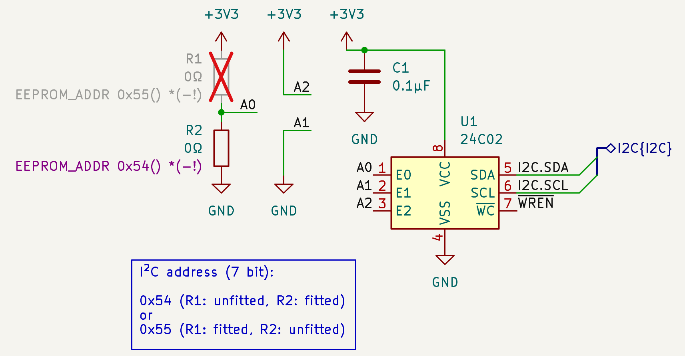
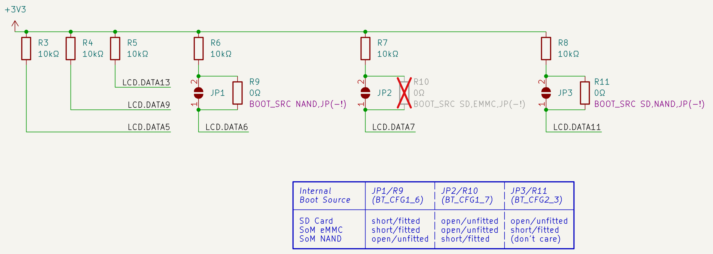
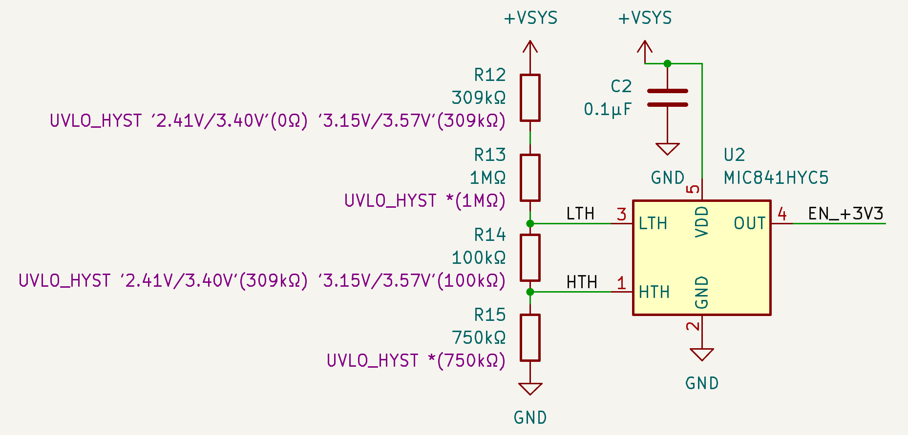
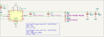
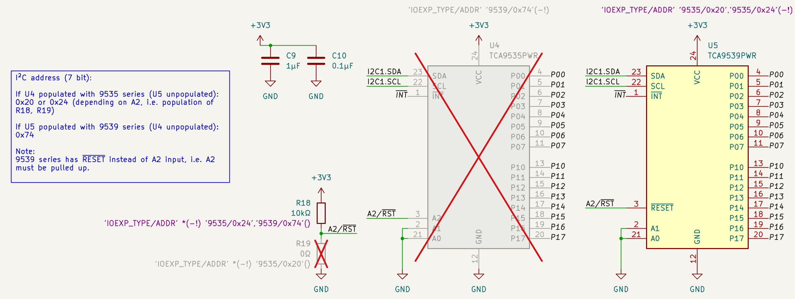
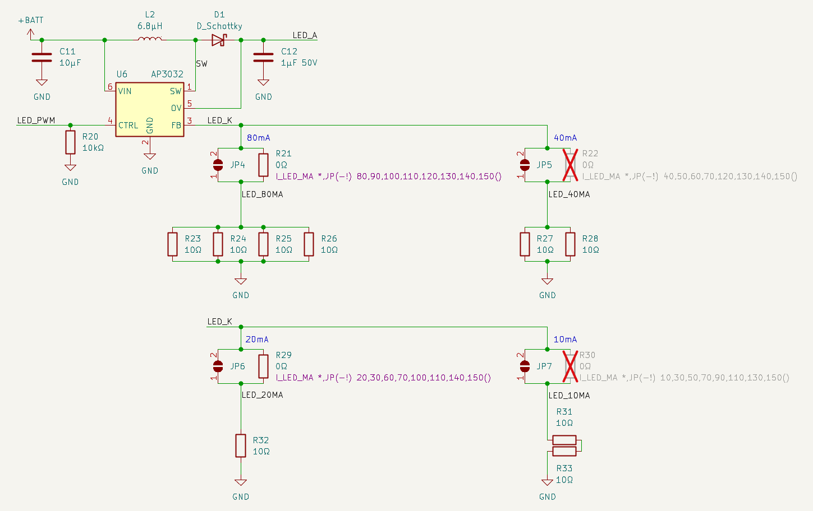
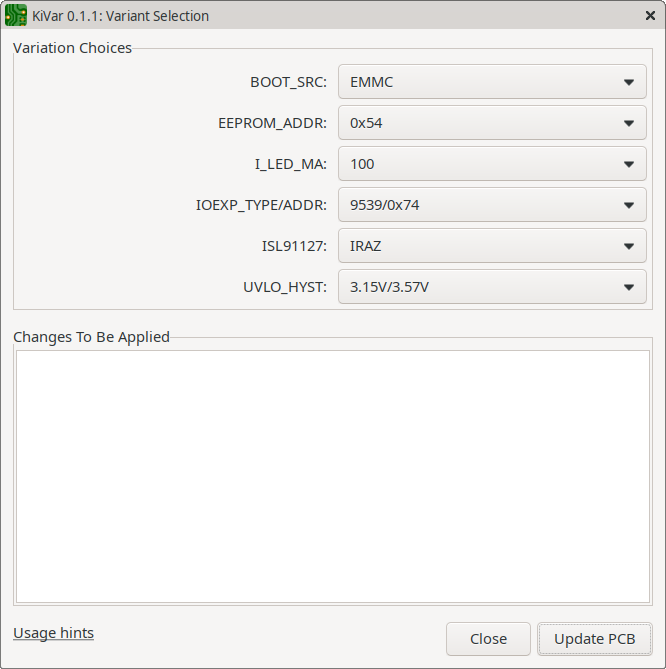
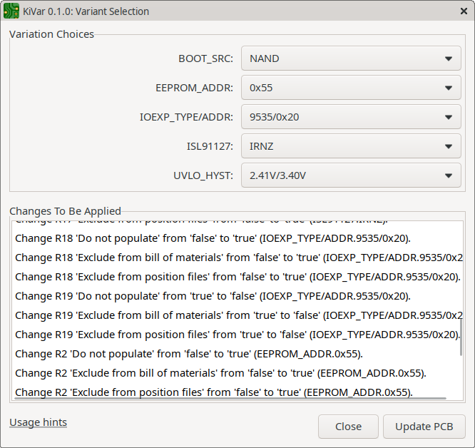
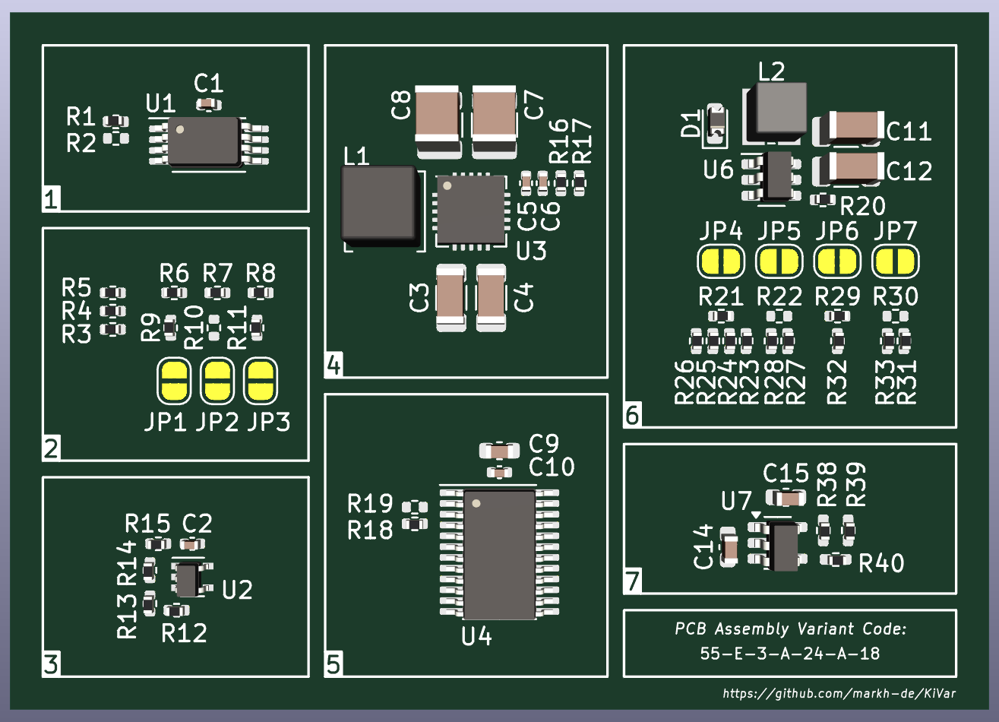
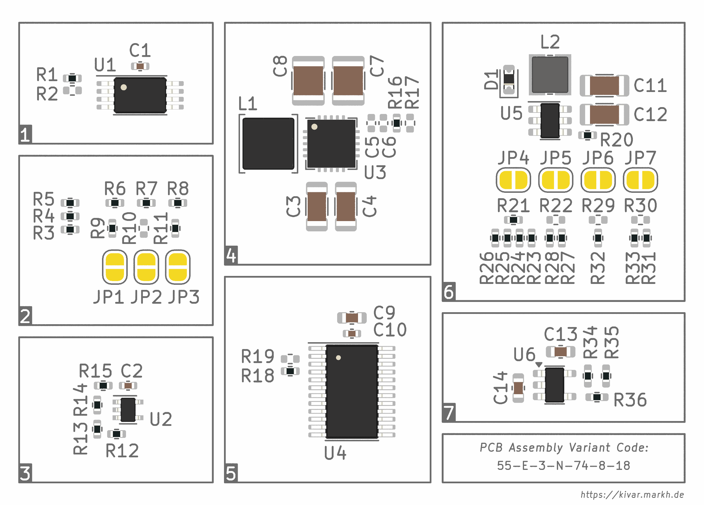

# KiVar − PCB Assembly Variants for KiCad

## Introduction


KiVar is a tool for **KiCad PCB Assembly Variant selection**, available as

 * **KiCad Action Plugin** and
 * **Command Line Application** (Python).

PCB component variation rules are defined in component (i.e. symbol or footprint) fields.  This allows for the complete variant configuration to be contained in the schematic and board files without requiring external data from outside the native KiCad design files.

The name _KiVar_ (for _KiCad Variants_, obviously) can also be read as an acronym for _**Ki**Cad **V**ariation **a**ssignment **r**ules_.

## Features

KiVar assigns PCB component **values** and **attributes** (such as _Do not populate_, _Not in position files_, _Not in BoM_) according to variation rules specified in footprint fields.  When applying those rules, component values and attributes are modified _in place_, allowing for immediate update of the PCB design as well as the 3D view and enabling compatibility with _any_ exporter.

Back-propagation of modified component data from the PCB to the schematic can be done in an extra step.

> ***TODO*** Add screenshot of plugin (same as below?), add screenshot of CLI app.

## Concepts

Key concepts of KiVar are:

 * Designs may contain **multiple** independent variation **aspects** (i.e. dimensions or degrees of freedom).
 * Variation rules are **fully contained** in component fields of native design files (no external configuration files) and **portable** (i.e. copying components to another design keeps their variation specification intact).
 * Component values and attributes are modified **in place**, enabling compatibility with all exporters that work on the actual component data.
 * **No external state information** is stored; currently matching variation choices are detected automatically.

## Supported KiCad Versions

KiVar releases 0.2.0 and later require at least **KiCad release 8**.

Earlier versions of KiVar also supported KiCad 7, but in a very restricted way.  Hence, after the release of KiCad 8, KiVar support for KiCad 7 was dropped.

## Installation

### KiVar Action Plugin

The KiVar Action Plugin uses the Python API wrapper for pcbnew, the KiCad PCB Editor.

> ***TODO*** ... so does the CLI. move this text to general info.

The recommended installation method is to use KiCad's integrated **Plugin and Content Manager**.  KiVar is included in the official PCM repository, allowing a smooth and safe installation experience.  For manual installation users can also choose to download the plugin archive packages.

#### Using the Plugin and Content Manager

Required steps:

1. Start the _Plugin and Content Manager_ from the KiCad main window.
2. Find _KiVar_ in the **Plugins** section.
3. Mark it for installation and apply the pending changes.
4. The _Kivar_ plugin icon should now appear in the PCB Editor (pcbnew) toolbar.

#### Using Manual Archive Extraction

Required steps:

1. Open the KiCad PCB Editor (pcbnew).
2. In the PCB Editor, choose the menu option _Tools &rarr; External Plugins &rarr; Open Plugin Directory_.  This will open a file browser at the location of your KiCad plugin directory.
3. Unzip the contents of an official [KiVar release archive](https://github.com/markh-de/KiVar/releases) (the ZIP file _without_ the `-pcm` suffix) to that KiCad plugin directory you opened in the previous step.  _Important:_ Do not create another directory inside the target plugin directory, but only place the files from the release archive directly in the plugin directory.
4. Switch back to the PCB Editor and choose the menu option _Tools &rarr; External Plugins &rarr; Refresh Plugins_.  The _KiVar_ plugin icon should now appear in the toolbar and in the plugin list under _Tools &rarr; External Plugins_.

If the installation does not work for you this way, consider reporting your problem as an issue in the KiVar bug tracker.

### KiVar Command Line Application

#### Using pip

The KiVar CLI Python package can be installed using the following methods.

##### From the PyPI Repository

To install the KiVar CLI using the official PyPI repository, open a shell and run:

```
pip install kivar
```

##### From a Release Archive

The KiVar CLI can also be installed using a downloaded (or locally created) Python Package:

```
pip install kivar-<VERSION>.tar.gz
```

## Usage

> ***TODO*** revise document structure and headings levels!

The process of writing and assigning rules to components (i.e. symbols and footprints) is done manually using simple text expressions.

Once all relevant components are equipped with their variation rules, KiVar allows the selection of variation choices using either an easy-to-use dialog interface (when using the Action Plugin) or a command-line interface (when using the CLI application) and takes care of the automatic analysis and assignment of the corresponding component values, fields and attributes.

The following sections describe the process of configuring your schematic or board and - after that - selecting a variation configuration from the previously configured variation choices.

### Component Variation Setup

The following sub-sections describe the variation rules setup procedure.

While it is recommended to define variation rules in the schematic (i.e. in symbol fields) and propagate them to the board, it is also possible to define those rules directly in the board (i.e. in footprint fields) and propagate them back to the schematic.  Either way, in the end the rules must be present in the footprint fields, as KiVar uses the _pcbnew_ API wrapper and can therefore only operate on board (not schematic) data, which must then be propagated back to the schematic as described in later sections. (TODO link)

<a name="migrate"></a>

#### Migrating from KiVar 0.1.x

KiVar 0.2.0 introduced changes and enhancements to the rule syntax.  The following sub-sections will support experienced users of KiVar 0.1.x with updating their legacy variation rules for current and upcoming KiVar versions.

##### New Field Names

Severity: **Critical**.

While KiVar 0.1.x and earlier used a single field named `KiVar.Rule`, current releases use the field `Var` for quite the same purpose.

So as a first step users should move all legacy rules from `KiVar.Rule` to `Var`.  This can be achieved by copying and pasting the values of the `KiVar.Rule` column over to the `Var` column in the KiCad Schematic Editor's Symbol Fields Table.

_Hint:_ To do this, open the Symbol Fields Table, sort by the legacy `KiVar.Rule` field, then copy & paste all relevant cells to the `Var` field (may need to be created first).  Afterwards, remove all `KiVar.Rule` fields (can be done in the Symbol Fields Table dialog).

##### Basic Rule Format

While the legacy format of the `KiVar.Rule` field is very similar to the current `Var` field expression format, there have been some changes that may (or may not) break your legacy rules.  Users will need to revise their legacy rules to be sure that they are parsed correctly with current (and upcoming) versions of KiVar.

The following sections will cover the details.

##### Property (Formerly Options) Inheritance

Severity: **Critical**.

Before version 0.2.0, there were Options (actually only _one_ Option).  An Option always started with a `-` (dash) character, followed by the Option identifier.  The only supported Option identifier was `!`, which resulted in the _Do not populate_, _Exclude from Position Files_ and _Exclude from BoM_ component attributes to be set (or cleared if the option was _not_ provided!).

An Option could either be specified or _not_ specified.  There was no way of removing/overriding an Option that was set via inheritance from a default Choice.

If an Option was specified in a Default choice (specified by the choice identifier `*`), that Option was **not inherited** by specific choice definitions, but would have to be specified again in the specific definitions in order to be effective for those choices.
This (questionable) design decision was made because, as mentioned above, there was no way to reset an option specified in a Default choice when overriding that Default choice with a specific choice.  Hence, every choice declaration/definition caused all options to be reset for that specific choice, to allow providing a fresh set of options for specific choices.

Values, however, were handled differently: They _were_ inherited from the Default choice definition.

With version 0.2.0, this behavior has changed.  Default Choice inheritance has been streamlined and now applies to both Values (now called _Content_) and Options (now called _Properties_), thanks to the introduction of Property polarities.  Polarities (called _Property Modifiers_) allow overriding property states with both _set_ (modifier `+`) and _unset_ (modifier `-`) operations.  That is, after the Default Property states are applied (inherited), specific choices can (partially) override those states.

There are now three supported effective Properties:
 * "Fit" (identifier `f`): Component is fitted.  Unsets the "Do not populate" component attribute.
 * "InPos" (identifier `p`): Component is listed in Position files.  Unsets the "Exclude from Position Files" component attribute.
 * "InBom" (identifier `b`): Component is listed in Bill of Materials.  Unsets the "Exclude from BoM" component attribute.

There is also a virtual Property `!`, which resolves to "Fit", "InPos" and "InBom", making the `-!` _nearly_ backwards-compatible.  However, **special care must be taken when `-!` appears in Default choices, as those Properties are now inherited by specific choices**.

The following examples try to illustrate the different handling:

_Old behavior:_

Rule String           | Resulting Choice1 Value | Resulting Choice1 Options | Resulting Choice2 Value | Resulting Choice2 Options |
--------------------- | ----------------------- | ------------------------- | ----------------------- | ------------------------- |
`*(10k -!) Choice2()` | `10k`                   | `-!`                      | `10k` (inheritance)     | _(none)_ (no inheritance) |

_New behavior:_

Rule String             | Resulting Choice1 Content | Resulting Choice1 Properties  | Resulting Choice2 Content | Resulting Choice2 Properties
----------------------- | ------------------------- | ----------------------------- | ------------------------- | --------------------------------
`*(10k -!) Choice2()`   | `10k`                     | `-!` (effectively `-f -b -p`) | `10k`                     | `-!` (effectively `-f -b -p`)
`*(10k -!) Choice2(+b)` | `10k`                     | `-!` (effectively `-f -b -p`) | `10k`                     | `-! +b` (effectively `-f +b -p`)

_Note:_ It is also important to note that **component attributes** (DNP, Not in Pos, Not in BoM) **are now kept at their current state** (and ignored in the Choice match) **if their corresponding properties are not defined (neither enabled, nor disabled)**.  In pre-0.2.0 versions all three attributes were either set or unset, depending on the presence of the `-!` option.  Version 0.2.0 introduces much more flexibility in attribute management.

##### Implicit Property Default States

Severity: **Not critical** (backwards-compatible).

Starting with version 0.2.0, users can choose to _only_ specify that Property State which makes a Choice unique and let the the KiVar rule compiler assume the opposite state to be the _implicit_ default State (if no default Property State is provided otherwise) for all remaining choices.

For example, if a component is only fitted (Property Identifier `f`) in one Choice (of many), it is now sufficient to specify `+f` in that Choice Expression and leave the rest of the choices, and even the default choice (`*`) definition, untouched.  The implicit default state for the `f` (fitted) Property will then automatically assumed to be the opposite (`-f`) for any other Choices.

_Note:_ Implicit Property States can only be used if there is only one State/Polarity (`+` exclusive-or `-`) assigned in any of the component's choices.

_Note:_ Implicit default States only work for Property States, as they use boolean states (actually tri-state, but as soon as a Property is provided, it's either _true_ or _false_) and therefore have an (implicit) "opposite" value.

##### Values As Multiple Words

Severity: **Not critical** (backwards-compatible).

Prior to version 0.2.0 multiple Value arguments were forbidden inside a choice expression.  Only a single Value argument was allowed to be assigned to a Choice definition.  In case of multiple "words", the argument had to be quoted (with `'` (single-quote) characters) in order to be accepted as a single argument.

Starting with version 0.2.0, choice expressions can now contain multiple Value (now called _Content_) arguments, which are joined with a single ` ` (space) character inbetween.

This change is fully backwards-compatible.  There is no need to adapt legacy rule strings.

##### Aspect Identifier Position

Severity: **Not critical** (backwards-compatible).

Before version 0.2.0 the aspect identifier (name) had to be the first argument in every rule string.  From version 0.2.0 on, the aspect identifier can be specified at any position, or even left away and instead be specified in a different component field (`Var.Aspect`).

This change is fully backwards-compatible.  There is no need to adapt legacy rule strings.

##### New Choice Expression Types and Formats

Severity: **Not critical** (backwards-compatible).

Versions before 0.2.0 supported only a single rule format in the `KiVar.Rule` component field.  From version 0.2.0 on, multiple rule (now called _Choice Expression_) formats are supported, which can be specified in different component fields.

This change is fully backwards-compatible.  There is no need to adapt legacy rule strings.

##### Double-Quote Characters Support

Severity: **Not critical** (backwards-compatible).

Prior to version 0.2.0 only `'` (single-quote) characters were supported for the purpose of quoting verbatim strings.

Starting with version 0.2.0, `"` (double-quote) characters are also supported for quoting.  Single- and double-quote strings can be nested, e.g. the string `"hello 'world'"` would result in `hello 'world'`.

This change is fully backwards-compatible.  There is no need to adapt legacy rule strings.

#### Definition of Terms

As mentioned before, KiVar supports multiple independent _variation aspects_ per board.  For each of these variation aspects, one _variation choice_ can be made later during the selection process.  The result of selecting a specific set of choices for a given set of aspects forms a _variation configuration_.

Basic terms used in this document:

 * **Aspect:**  
   A dimension of variation changes, which are defined by _Choices_ (see below).  One PCB design can refer to multiple aspects.  Each component, which makes use of KiVar variations, must refer to exactly one aspect identifier.
 
 * **Choice:**  
   A set of values (component values or field contents) and/or properties to be assigned to specific components.  A Choice is always related to a specific _Aspect_.

 * **Configuration:**  
   A fully defined set of specific _Choices_ for _all_ available _Aspects_.  In other words, one specific board assembly variant state.

#### Basic Rules Structure

Each component (which uses KiVar variation rules) must refer to exactly one **Aspect**.  The **Choices** defined or referred to in the component are always related to that Aspect.

There can exist multiple Aspects per design, and for each Aspect there can exist multiple Choices.

Example:

 * Aspect `DEV_ADDR`
   * Choice `0x50`
   * Choice `0x51`
   * Choice `0x52`

 * Aspect `BOOT_SRC`
   * Choice `EMMC`
   * Choice `SDCARD`
   * Choice `NAND`

 * Aspect `VIO_LEVEL`
   * Choice `1.8V`
   * Choice `2.5V`
   * Choice `3.3V`

One possible example _Configuration_ for these Aspects and Choices:

`DEV_ADDR=0x52 BOOT_SRC=NAND VIO_LEVEL=1.8V`

KiVar computes such sets of Aspect and Choice definitions internally by checking each component's field data for KiVar _Choice Expressions_, which are explained in the following sections.

#### Choice Expressions

Component variation rules are specified in **Choice Expression**s (short: _CE_), which are defined in the fields of each component (i.e. symbol and/or footprint) they relate to.  Multiple components may (and usually will) refer to the same aspects and choices.

One component must relate to a single aspect, but can relate to an unlimited number of choices for that aspect.

Choice expressions can be noted in various formats, which are described in the following sections from their innermost to the outermost elements.

#### Choice Arguments

In its simplest form, a Choice Expression consists only of a **Choice Argument List** (short: _CAL_), which is just a list of _space_-separated **Choice Argument**s (short: _CA_) to be assigned to a component for a specific choice.

Each _Choice Argument_ of the _Choice Argument List_ can be of one of two possible types:
 * a part of the **content** to be assigned as the component _value_ or a specific _field_ or
 * a **property** assignment specifier (to mark a component _(un)fitted_, _(not) in BoM_, _(not) in position files_).

Argument types are distinguished by their first (unescaped) character and will be explained in more detail in the followin sub-sections.

##### Content Specifiers

###### Purpose

One or more Content Specifiers can be used to assign a string to the component value or to any (custom) component field (such as _Manufacturer_, _MPN_, ...).

<!-- TODO more? -->

###### Syntax

Each argument beginning with a character _other than_ `-` and `+` is interpreted as a **Content Specifier**.

There can be multiple Content Specifiers in each Choice Expression.  Their values will be concatenated with one ` ` (space) character as separator to form the resulting Content string.  However, each choice may have only a maximum of one resulting Content assigned.  For example: `Choice1("hello world"   foo bar)` will result in `Choice1` to be assigned the content `hello world foo bar`, but multiple content assignments to the same Choice, such as `Choice1("hello world") Choice1(foo bar)`, are invalid.  This restriction is due to the fact that Choice Expressions can be provided in several ways (fields) and there is no guaranteed processing (concatenation) order.

_Note:_ As arguments can be separated by _any_ number of space characters, each separation will result in a single space character in the final content, no matter how many spaces were used for the argument separation originally.  For strings that shall be assigned in a verbatim way (such as a URL), it is highly recommended to use quoting techniques (discussed later).

###### Evaluation

All Content Specifiers of a Choice Expression are evaluated from left to right and concatenated with one space character between each argument to form the final content string to be assigned when the corresponding choice is selected.

###### Examples

The Content Specifiers in the following input Choice Argument Lists will result in the following Content strings:

Choice Argument List input | Resulting Content string | Explanation
-------------------------- | ------------------------ | -----------
`100nF`                    | `100nF`                  | Simple single arguments can be noted without escaping or quoting as long as they don't contain certain special characters (discussed later).
`470µF 10%`                | `470µF 10%`              | Uncritical text, no verbatim adoption of the arguments required.
`470µF   10%`              | `470µF 10%`              | Multiple separator characters will be converted to a single separator. As the text is uncritical, this conversion may even be desired.
`'https://kivar.markh.de/ds/abc123.pdf'` | `https://kivar.markh.de/ds/abc123.pdf` | Strings to be used verbatim should always be enclosed in quote characters.
`'abc   def ' 123   456`   | `abc   def  123 456`     | Mixed type of quoted and unquoted representation.  Note how the trailing space after `def` remains contained in the result.
`abc "def 'ghi' jkl" mno`  | `abc def 'ghi' jkl mno`  | Outer double quotes encapsulate inner single quotes, which are part of the verbatim string.
`abc 'def "ghi" jkl' mno`  | `abc def "ghi" jkl mno`  | Outer single quotes encapsulate inner double quotes, which are part of the verbatim string.
`abc \d\e\f\ \ ghi\'jkl\\mno` | `abc def  ghi'jkl\mno` | Escaping (prepending a backslash) ensures that the following character is interpreted verbatim, not as a special character.  To create a backslash (the escape character) string, use a double backslash (i.e. escape the backslash).
`\+10% \-5% \-12V \+5V`    | `+10% -5% -12V +5V`      | If the first character of a Content Specifier is a `-` or `+`, the corresponding Choice Argument must be prepended with a backslash (`\`) character or be part of a verbatim string (see next example).
`"+10%" '-5%' "-"12V '+'5V` | `+10% -5% -12V +5V`     | If the first character of a Content Specifier is a `-` or `+`, the corresponding Choice Argument must be part of a verbatim string or be prepended with a backslash (`\`) character (see previous example).

##### Property Choice Arguments

###### Purpose

To modify component attributes, such as _Do not populate_, _Not in Position Files_ or _Not in BoM_, KiVar provides a set of boolean component **Properties** that can be assigned to choices.

###### Syntax

Each argument beginning with a `-` or `+` is interpreted as a **Property Specifier**, which is a combination of **Property Modifiers** and **Property Identifiers**.

Each Property Specifier must start with a Property Modifier, defining the boolean state (_true_ or _false_, represented by `+` or `-`, respectively) to be assigned to the Properties subsequently specified by their corresponding Property Identifiers.

###### Evaluation

All Property Specifiers inside a Choice Expression are evaluated from left to right, resulting in a set of defined boolean Property states for the corresponding component and choice.  Properties not defined in any of the component's Choices are kept in their original state.

###### Effective Properties

The following effective Properties are available:

 * **Fitted** (property identifier `f`).  
   This property specifies whether a component shall be fitted (property _true_) or unfitted (property _false_).  This property is linked to the pcbnew footprint attribute _Do not populate_ with inverted polarity.
 * **inPos** (property identifier `p`).  
   This property specifies whether a component shall be included in the component placement/position files (property _true_) or excluded (property _false_).  This property is linked to the pcbnew footprint attribute _Not in Position Files_ with inverted polarity.
 * **inBom** (property identifier `b`).  
   This property specifies whether a component shall be included in the Bill of Materials (property _true_) or excluded (property _false_).  This property is linked to the pcbnew footprint attribute _Not in BoM_ with inverted polarity.

###### Virtual Properties

> ***TODO*** find a better name for virtual ... placeholder ...?

> ***TODO*** explain `!`, which acts as bfp, and can be overridden later

###### Examples

The Property Specifiers in the following input Choice Argument Lists will result in the following Property states:

Choice Argument List input | Resulting Property states | Explanation
-------------------------- | ------------------------- | -----------
`-f`                       |  _not_ Fitted             | The `-` causes _false_ to be assigned to the subsequent properties, i.e. _Fitted_.  The footprint's attribute _Do not populate_ will be set to _true_.
`-fbp`                     |  _not_ Fitted, _not_ inBom, _not_ inPos | One modifier (`-`) can be used for any number of subsequent identifiers.
`-!`                       |  _not_ Fitted, _not_ inBom, _not_ inPos | Equivalent to prior example.
`-! +b`                    |  _not_ Fitted, inBom, _not_ inPos | After setting `f`, `b`, `p` to false, `b` is set to true again.
`-!+b`                     |  _not_ Fitted, inBom, _not_ inPos | Equivalent to prior example.  Multiple modifiers can appear inside a single specifier.

#### Choice Identifiers

##### Purpose

> TODO

##### Syntax

> TODO, CIs are part of CILs ...

##### Default Choices

> TODO

##### Implicit Defaults

> TODO only for boolean values, such as properties

##### Examples

> TODO multiple components, to illustrate default choice behavior

> TODO following sections one heading level up

#### Choice Expression Scopes

The data defined in Choice Expressions can be applied to either
 * the component's basic properties (i.e. component _value_ and _attributes_), or to
 * custom component fields (such as _Manufacturer_, _MPN_, ...).

For each of them there exists a dedicated **Choice Expression Scope**.  Both scopes are explained in the following sub-sections.

##### Base Choice Expressions

###### Purpose

**Base Choice Expressions** (BCE) are used to assign component **values** (using Content Choice Arguments) and **attributes** (using Content Property Arguments).

Also, they **declare** and **define** choices for a given aspect.

###### Typical Use

BCEs are used to assign component values, such as `10kΩ`, `0.1µF 50V` or `74HC595`.  The component value is defined by the choice content (assigned through Content Choice Arguments).

They are also used to modify component attributes, e.g. when a component shall change its _DNP_ (do not populate) state or when it shall or shall not be included in position files or the bill of materials.  Component attributes are defined by choice properties (assigned through Property Choice Arguments).

BCEs can _not_ modify custom fields.  For this, ACEs must be used (see below).

###### Data Assignment

> TODO content and properties ... how are they mapped to the component data

###### Examples

As BCEs only specify an expression scope and not a real Choice Expression Type, examples are provided in the sections ***TODO link*** (SBCE) and ***TODO link*** (CBCE).

##### Auxiliary Choice Expressions

###### Purpose

**Auxiliary Choice Expressions** (ACE) assign values to specific component **custom fields** (using Content Choice Arguments).

They do _not_ declare additional choices, but can **only refer** to aspect choices declared in Base Choice Expressions.

Each Choice Identifier used in an ACE must therefore be declared in a BCE, even if no change of the component value or attributes is required (***TODO*** link to CI declaration w/o definition).

Also, ACEs do not support specifying properties, as they do not refer to the component itself, but to dedicated fields within it.

###### Typical Use

ACEs are used to assign custom field values, such as a manufacturer name or a manufacturer product number (MPN) to be used in the bill of materials.  However, ACEs can also be used for other information, such as a choice-dependent device address.  That information can then be made visible in the schematic for informational purposes.  This can be used to automatically streamline schematic documentation.

###### Data Assignment

> TODO how is data mapped

###### Examples

As ACEs only specify an expression scope and not a real Choice Expression Type, examples are provided in the sections ***TODO link*** (SACE) and ***TODO link*** (CACE).

#### Choice Expression Formats

Furthermore, Choice Expressions can be noted in different ways, depending on the user's preferences and requirements.

The two different **Choice Expression Formats** are described in the following sub-sections.

##### Simple Choice Expressions

###### Purpose

**Simple Choice Expressions** (SCE)
 * specify a single Choice Expression using
 * one specific component field per expression.

###### Typical Use

> TODO

###### Examples

As SCEs only specify an expression format and not a real Choice Expression Type, examples are provided in the sections ***TODO link*** (SBCE) and ***TODO link*** (SACE).

##### Combined Choice Expressions

**Combined Choice Expressions** (CCE)
 * allow combining multiple Choice Expressions in a
 * single component field (also, for Base Choice Expressions, optionally accepting the Aspect identifier).

###### Typical Use

> TODO

###### Examples

As CCEs only specify an expression format and not a real Choice Expression Type, examples are provided in the sections ***TODO link*** (CBCE) and ***TODO link*** (CACE).

#### Choice Expression Types

The combination of the above two Expression Scopes and two Expression Formats results in the following four **Choice Expression Types** discussed in the following sub-sections.

##### Simple Base Choice Expressions

###### Syntax

**Simple Base Choice Expressions** (SBCE)  
use the field `Var(<CHOICELIST>)` with field content in [SCE](#SCE) format to assign component value and properties to a specific choice list `<CHOICELIST>`.

###### Typical Use

> TODO

###### Examples

> TODO

##### Combined Base Choice Expressions

###### Syntax

**Combined Base Choice Expressions** (CBCE)  
use the field `Var` with field content in [CCE](#CCE) format (with an Aspect identifier allowed) to assign component values and properties to one or more choice lists.

###### Typical Use

> TODO

###### Examples

> TODO

##### Simple Auxiliary Choice Expressions

###### Syntax

**Simple Auxiliary Choice Expressions** (SACE)  
use the field `<CUSTOMFIELD>.Var(<CHOICELIST>)` with field content in [SCE](#SCE) format to assign a specific value for the component's custom field `<CUSTOMFIELD>` to a specific choice list `<CHOICELIST>`.

###### Typical Use

> TODO

###### Examples

> TODO

##### Combined Auxiliary Choice Expressions

###### Syntax

**Combined Auxiliary Choice Expressions** (CACE)  
use the field `<CUSTOMFIELD>.Var` with field content in [CCE](#CCE) format (with no Aspect identifier allowed) to assign values for the component's custom field `<CUSTOMFIELD>` to one or more choice lists.

###### Typical Use

> TODO

###### Examples

> TODO

#### Aspect Identifier

##### Purpose

> ***TODO***

##### Specification

As mentioned above, each component that provides KiVar variation rules must refer to exactly one Aspect.

There are two methods of passing the **Aspect Identifier**:

1. Using the _dedicated component field_ `Var.Aspect`, or
2. as part of a _Combined Base Choice Expression_.

Details and examples can be found in the following sections.

> TODO more


> ***TODO*** a **lot** of old stuff removed from here. re-insert sections that are still valid!


> ***TODO*** Usage tips section. when to use which ce type? some examples. more examples in the real-world section.

> ***TODO*** Q&A section that handles the most obvious questions

#### Real-World Examples

The following examples are taken from a real project and show a few configurable variation aspects, their possible choices along with a short explanation of the implementation.

Each example is illustrated with a schematic snippet including the values of the `KiVar.Rule` field of each related symbol.

> ***TODO*** try using SVG scm plotting (and clipping in inkscape!) again, try a different color scheme, try without background color

##### Example 1: I²C Device Address Selection

This is a very simple example, used for address selection of an I²C device.  Address input A0 switches between device addresses 0x54 _(A0=0)_ and 0x55 _(A0=1)_.



The device address is selected by tying the IC input A0 to either +3V3 or GND, depending on the selected choice.  Inputs A1 and A2 are tied to fixed levels.

How to read the rules:

 * Variation aspect is `EEPROM_ADDR` (with choice `0x54` currently applied in the figure).
 * **R1**: For choice `0x55` this part will be fitted (empty definition, hence fitted), else unfitted (per default choice).
 * **R2**: Similarly, for choice `0x54` this part will be fitted, else unfitted.

Alternatively, the rules in this example could explicitly list _those_ choices that make the corresponding parts _unfitted_.  However, with the above notation, the rules can be read more naturally.  That is, choice 0x55 is listed in the upper resistor and leads to high voltage level and choice 0x54 is listed in the lower resistor and leads to low voltage level.

##### Example 2: Boot Source Selection

This is used for the boot source device selection for an NXP i.MX6ULL SoC.



The variation choices provide selection between the boot sources `EMMC`, `SD` and `NAND`, as well as an extra choice `JP` (which leaves _all_ configuration resistors unfitted, so that the user can configure the board by manually shorting the solder bridges JP1, JP2, JP3).

How to read the rules:

 * Variation aspect is `BOOT_SRC` (with choice `EMMC` currently applied in the figure).
 * **R9**: For choices `NAND` and `JP` this part is unfitted, else (`SD` and `EMMC`) fitted.
 * **R10**: For choices `SD`, `EMMC` and `JP` this part is unfitted, else (`NAND`) fitted.
 * **R11**: For choices `SD`, `NAND` and `JP` this part is unfitted, else (`EMMC`) fitted.

##### Example 3: Undervoltage Trip Points

Typical use-cases for variations are resistor divider networks, such as voltage regulator feedback dividers or — in this case — a voltage divider with two taps for a programmable hysteresis on an undervoltage lock-out (UVLO) circuit.



The used variation aspect defines all four resistors (only two of them with varying values), allowing to select the lower (cut-off) and higher (recovery) voltage limits for the supply voltage monitor IC.

How to read the rules:

 * Variation aspect is `UVLO_HYST` (with choice `3.15V/3.57V` currently applied in the figure).
 * **R12**: For choice `2.41V/3.40V` the value is `0Ω`, for choice `3.15V/3.57V`, the value is `309kΩ`.
 * **R13**: The value is always set to `1MΩ`.  It is not really required to apply a value, or to use a variation rule at all for this symbol.  However, in case more choices are added in the future, it is very likely that the value of this resistor will change.  Hence the resistor symbol has the rule entry already prepared for easy introduction of new choices.
 * **R14**: For choice `2.41V/3.40V` the value is `309kΩ`, for choice `3.15V/3.57V`, the value is `100kΩ`.
 * **R15**: The value is always set to `750kΩ`.  Same explanation applies as for R13.

##### Example 4: IC Variant Selection

This is used for selection of peripheral parts on a boost-buck-converter IC, which is available as _fixed_ (IRNZ suffix) and _adjustable_ (IRAZ suffix) voltage variants (just like many LDOs are, too).  Depending on the market availability of those IC variants, this variation aspect helps to quickly select between assembly options.

<!-- TODO prefer native markdown syntax over HTML ... how to scale to 100% width?

-->


The fixed voltage IC variant requires a direct feedback of the output voltage to the FB pin, while the adjustable voltage IC variant requires a typical feedback resistor network, including a capacitance of 66pF for stabilization.

How to read the rules:

 * Variation aspect is `ISL91127` (with choice `IRAZ` currently applied in the figure).
 * **C5**, **C6**: For choice `IRNZ` this part is unfitted, else (`IRAZ`) fitted.
 * **R16**: For choice `IRNZ` the value is `0Ω` (fixed version using direct output voltage feedback), for choice `IRAZ` the value is `1MΩ` (adjustable version using a voltage divider for feedback).
 * **R17**: For choice `IRNZ` this part is unfitted (fixed version only has direct feedback, no resistor network), else (`IRAZ`) it is fitted (adjustable version using a voltage divider for feedback).

_Note:_ The rule for **R16** is the _only_ rule explicitly mentioning the choice `IRAZ`, declaring that choice name for all rules that refer to the same variation aspect (`ISL91127`).  For every aspect, you need at least one rule explicitly mentioning a choice for the choice name to be declared and selectable.

_Note:_ In this example, the IC itself keeps its original value (part number without IC variant suffix).  In its current state KiVar can only change part values, no other fields (e.g. ordering information).  If you want to switch between different part types (with different symbols or ordering information) or footprints, you need to use multiple _alternate_ symbol instances with each one defining its own set of relevant fields and only one of them actually fitted (refer to next example).

##### Example 5: IC Type and Address Selection

This is used for selection of an I/O expander IC type (953**5** vs. 953**9**) along with its I²C address.  Different (footprint-compatible!) IC types interpret the input on pin 3 differently ("A2" vs. "/RESET").  See the text callout in the figure for details.



This example really implements two simple aspects in one variation aspect definition: The type of the IC and the device address.  As both aspects depend on each other and can only be defined in a combined way, all possible combinations must be defined.  It is recommended to use the same dedicated sub-aspect separation character (`/` used in this example) in the aspect name as well as the choice names to make it obvious to the user which sub-choice applies to which sub-aspect.

In order to **switch the full set of ordering information or symbol and footprint library references** stored in the symbol fields, this example selects one of two alternate symbol instances, each using a slightly different symbol drawing (note the difference on pin 3).

In general, this variation technique can be used to switch between symbols that refer to either the same footprint (as in this example) or a different footprint shape (e.g. SMT vs. THT, or different SMT package sizes), which can exist side by side or even overlaid in the same spot of the PCB (only the footprints, _not_ the actual components!).

_Hint:_ Should you decide to use multiple overlapping footprint instances (of course, only one of them fitted with the actual component), the following custom DRC rule might become handy:

    (version 1)

    (rule "Allow overlapping courtyards for DNP parts"
        (condition "A.Type == 'Footprint' && B.Type == 'Footprint' && A.Do_not_populate")
        (constraint courtyard_clearance (min -1mm))
    )

_Note:_ If copper pads of multiple _alternate(!)_ footprints do overlap, it is important to assign the same net to each set of overlapping pads, in order to avoid DRC errors.  Some overlapping pads of alternate footprints will be applied the same net anyway (as in this example), but _unconnected_ symbol pins will automatically be applied calculated net names which will naturally conflict with those of alternate symbols if their corresponding copper pads overlap in the PCB.  It is then required to connect the unconnected pins with each other in the schematic (using wires or labels).  In the above example, visually distinguishable labels (P00..P17) were chosen for such connections that are otherwise without function.

How to read the sub-aspects:

This example uses variation aspect `IOEXP_TYPE/ADDR` (read as: sub-aspects `IOEXP_TYPE` and `IOEXP_ADDR`) with choice `9539/0x74` (read as: `9539` selected for `IOEXP_TYPE`, `0x74` selected for `IOEXP_ADDR`) currently applied in the figure.

How to read the rules:

 * Variation aspect is `IOEXP_TYPE/ADDR` (see above).
 * **R18**: This is unfitted by default (i.e. for each choice not defined otherwise in this rule).  For choices `9535/0x24` and `9539/0x74` this part will be fitted (the empty choice definition overrides all options of the default choice, i.e. no "unfit" option set for these specific choices).
 * **R19**: This is unfitted by default (like R18).  For choice `9535/0x20` this part will be fitted (same reason as for R18).
 * **U4**: This rule explicitly lists all choices for which this part is unfitted: `9539/0x74`.  For other choices the part will be fitted.
 * **U5**: This rule explicitly lists all choices for which this part is unfitted: `9535/0x20` and `9539/0x74`.  For other choices the part will be fitted.

##### Example 6: Backlight LED Maximum Constant Current Selection

In this example a combination of resistor networks determines the maximum constant current for an LED backlight (_maximum_ because the used current regulator also has a PWM input, which is later controlled via software).



The resistor network combination allows to select an LED current from 10mA to 150mA in steps of 10mA.  Also, like in example 2, there is an additional choice `JP`, which leaves all four configuration resistors unfitted, so that the user can manually select the current using the solder bridges.

How to read the rules:

 * Variation aspect is `I_LED_MA` (with choice `100` currently applied in the figure).
 * **R21**: This is the _most significant_ path for 80mA current. For the upper half of the current choices, i.e. `80` up to `150`, the resistor is fitted.  For other choices (incl. `JP`) the part will be unfitted.
 * **R22**: This is the path for 40mA current. For choices `40` to `70` and for `120` to `150` the resistor is fitted.  For other choices (incl. `JP`) the part will be unfitted.
 * **R29**: This is the path for 20mA current. For choices `20`, `30`, `60`, `70`, `100`, `110`, `140`, `150` the resistor is fitted.  For other choices (incl. `JP`) the part will be unfitted.
 * **R30**: This is the _least significant_ path for 10mA current. For choices `10`, `30`, `50`, `70`, `90`, `110`, `130`, `150` the resistor is fitted.  For other choices (incl. `JP`) the part will be unfitted.

### Rules Application

After setting up the rules for each relevant symbol (or footprint), variations can finally be switched using the _KiVar_ plugin.

#### Update the PCB

If the rules were set up in the Schematic Editor (eeschema), they need to be updated to the PCB Editor first (menu item _Tools &rarr; Update PCB from Schematic..._).

#### Start the Plugin

To run the plugin, choose the _KiVar_ menu item under _Tools &rarr; External Plugins_ or simply click the KiVar plugin icon in the main toolbar (if configured so).

#### Configuration Identification

Upon start, during the enumeration stage, KiVar automatically detects the current variation configuration, i.e., it tries to find a definite choice for each configured variation, based on the currently assigned values and attributes for each related footprint.

If the values and attributes do not exactly match one definite choice (for a variation aspect), then the corresponding variation choice selector is preset to the entry _'\<unset>'_.  This will probably happen before applying a specific choice for the first time or after editing rules, because not all of the currently assigned footprint attributes may perfectly match one of the defined variation choices.

#### Possible Error Messages

In case the defined variation rules cannot be parsed and enumerated without problems, an error message window with a list of problems will appear.  Each of these problems must then be fixed in order to successfully start the plugin.

_Hint:_ You can click each error message to focus the corresponding footprint on the _pcbnew_ canvas in the background (KiCad 8 and later only).

#### Variation Choices Selection

If all rules can be parsed without problems, the main dialog window appears.

For the above [real-world examples](#real-world-examples), the selection dialog window may look similar to the following:



For each of the listed variation aspects a variation choice can now be selected.

If the values and attributes of the footprint(s) related to a variation aspect shall not be modified, the entry _'\<unset>'_ can be selected for that variation aspect.  In this case, the corresponding variation is skipped during the assignment stage and related footprints remain unmodified.

The change list section below the selection area summarizes all component value and attribute changes to be performed for each related footprint if the current variation configuration is applied.

_Hint:_ You can click each entry in the change list to focus the corresponding footprint on the _pcbnew_ canvas in the background (KiCad 8 and later only).

After selecting a few different variation choices, the dialog window may look like the following:



When clicking the _Update PCB_ button, KiVar sets the values and attributes for all relevant footprints as previewed in the information text box.

#### Visible Changes

The performed changes will immediately be visible in the PCB Editor (e.g. for shown footprint values) and the 3D Viewer window (immediately or after refresh, depending on the preferences setting).

The following images show the 3D board view for the original settings:



... and after applying the new variation configuration (according to the dialog window above):



#### Updating the Schematic

All changes by the plugin are only performed in the board, as KiVar is a plugin for _pcbnew_ (_eeschema_ does not yet have a plugin interface).  That is, the performed changes must be propagated back from the board to the schematic in order to be visible there (e.g. for changed values and DNP markings).

To propagate the changes back to the schematic, use the PCB Editor menu item _Tools &rarr; Update Schematic from PCB..._ and make sure to select the checkboxes _Values_ and _Attributes_\*.  If you have modified the KiVar rules inside the PCB Editor, i.e. edited the footprint fields\* instead of the symbol fields, then also select the checkbox _Other fields_\*, in order to propagate your KiVar rules to the schematic.

\* _KiCad release 7 does not yet use the concept of footprint fields and can only propagate the footprint value back to the corresponding symbol value.  Also, footprints do not yet have a 'Do not populate' footprint attribute and back-propagation of attributes is not yet supported in release 7.  That is, the 'DNP' state of a schematic symbol can **not** be changed using the 'Update Schematic from PCB...' mechanism.  KiCad releases 8 and later **do** support all of these feartures and therefore provide support for all features currently required by KiVar.  Refer to section '[Supported KiCad Versions](#supported-kicad-versions)' for details._
