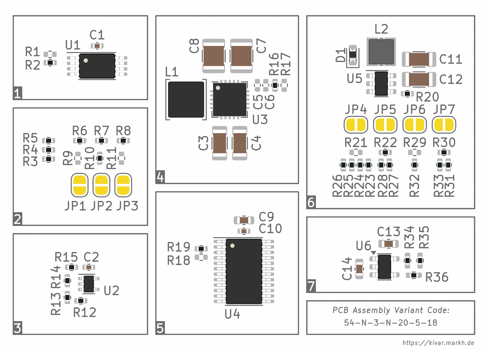

# KiVar − PCB Assembly Variants for KiCad

## Introduction

KiVar is a KiCad Action Plugin providing convenient PCB assembly variant selection.

Component variations are specified by rules defined in dedicated symbol or footprint fields.  This allows for the complete variant configuration to be contained in the schematic and board files without requiring external data from outside the native KiCad design files.

The plugin name _KiVar_ may be read as an acronym for _**Ki**Cad **V**ariation **a**ssignment **r**ules_.

## Features

KiVar assigns component **values** and **attributes** (such as _Do not populate_) according to variation rules specified in footprint fields.  Component values and attributes are modified _in place_, allowing for immediate update of the PCB design as well as the 3D view and enabling compatibility with _any_ exporter.

Back-propagation of modified component data to the schematic can be done in an extra step.

## Concepts

The key concepts of KiVar are:

 * Support for **multiple** independent variation aspects (i.e., dimensions, degrees of freedom) per design.
 * Variation rules are **fully contained** in symbol/footprint fields of native design files (no external configuration files) and **portable** (copying components to another design keeps their variation specification intact).
 * **Seamless integration** of the choice selection process, giving the impression of a native KiCad feature.
 * Component values and attributes are modified **in place**, enabling compatibility with all exporters that work on the actual component data.

## Supported KiCad Versions

KiVar is targeted towards release 8 of KiCad.  However, basic feature and API support is already provided by KiCad 7 releases.

The following table provides a feature support overview.

|Feature                                              |KiCad 7|KiCad 8 and later|
|-----------------------------------------------------|-------|-----------------|
|Edit variation rule definitions in symbols           |**Yes**|**Yes**          |
|Edit variation rule definitions in footprints        |No     |**Yes**          |
|Apply value and DNP variation choices in PCB         |**Yes**|**Yes**          |
|Apply footprint attribute "Do not populate"          |No     |**Yes**          |
|Apply footprint attribute "Exclude from BoM"         |**Yes**|**Yes**          |
|Apply footprint attribute "Exclude from Pos Files"   |**Yes**|**Yes**          |
|Update schematic symbol values from PCB              |**Yes**|**Yes**          |
|Update schematic symbol attribute "DNP" from PCB     |No     |**Yes**          |
|Update schematic variation definitions from PCB      |No     |**Yes**          |
|Changes and errors can be clicked to focus components|No     |**Yes**          |

## Installation

KiVar can be installed from the official KiCad **Plugin and Content Manager** repository.  This is the recommended way for installation, as it provides automated updates and requires the least amount of installation effort.  However, archives for manual installation are also provided.

### Install Via Plugin and Content Manager

Required steps:

1. Start the _Plugin and Content Manager_ from the KiCad main window.
2. Find _KiVar_ in the **Plugins** section.
3. Mark it for installation and apply the pending changes.
4. _Optional:_ For quick access, start the PCB Editor (pcbnew) and add the KiVar launcher button to your main toolbar under _Preferences &rarr; Preferences... &rarr; PCB Editor &rarr; Action Plugins_ by clicking the corresponding checkbox in the _Show button_ column.

### Install Via Manual Archive Extraction

Required steps:

1. Open the KiCad PCB Editor (pcbnew).
2. In the PCB Editor, choose the menu option _Tools &rarr; External Plugins &rarr; Open Plugin Directory_.  This will open a file browser at the location of your KiCad plugin directory.
3. Unzip the contents of an official [KiVar release archive](https://github.com/markh-de/KiVar/releases) (the ZIP file _without_ the `-pcm` suffix) to that KiCad plugin directory you opened in the previous step.  _Important:_ Do not create another directory inside the target plugin directory, but only place the files from the release archive directly in the plugin directory.
4. Switch back to the PCB Editor and choose the menu option _Tools &rarr; External Plugins &rarr; Refresh Plugins_.  Now _KiVar_ should appear in the plugin list under _Tools &rarr; External Plugins_.
5. _Optional:_ For quick access, add the KiVar launcher button to your main toolbar under _Preferences &rarr; Preferences... &rarr; PCB Editor &rarr; Action Plugins_ by clicking the corresponding checkbox in the _Show button_ column.

If the installation does not work for you this way, consider reporting your problem as an issue in the KiVar bug tracker.

## Usage

The process of writing and assigning rules to components (symbols/footprints) is done manually using simple expressions.

Once all relevant components are equipped with their variation rules, the KiVar plugin allows the selection of variation choices providing an easy-to-use dialog interface and takes care of the automatic assignment of the corresponding component values and attributes.

The following sections describe the process of configuring your schematic or board and, after that, selecting a variation configuration from the previously configured variation choices.

### Component Variation Setup

The following sub-sections describe the variation rules setup procedure.

For _KiCad 7 releases_, variation rules must be defined in the _schematic_ and then propagated to the board, on which the plugin operates on (use _Tools &rarr; Update PCB from Schematic..._).  Setting up the variation rules directly in the board is not possible with KiCad 7, as this version does not yet provide footprint user fields, but instead only one-way-copies symbol fields to footprint _properties_, which are not exposed to the user interface in an editable way (but the data is stored internally and used by KiVar) and cannot be propagated back to the schematic.

For _KiCad 8 and later_, it's up to the user to either edit the _schematic or board_ to setup the variation rules, as these versions provide footprint fields and synchronization of symbol and footprint fields in _both_ directions.

No matter which KiCad version is used, being a _pcbnew_ Action Plugin, KiVar always uses the footprint data found in the currently opened _board_.  So all relevant symbol modifications done in the schematic _must be updated from the schematic to the board_ before using the plugin (described below in more detail).

#### Definition of Terms

As mentioned before, KiVar supports multiple independent _variation aspects_ per board.  For each of these variation aspects, one _variation choice_ can be made later during the selection process.  The result of selecting a specific set of choices for a given set of aspects forms a _variation configuration_.

Terms used in this document:

 * **Aspect:**
   A dimension of variation changes, which are defined by _Choices_ (see below).
 
 * **Choice:**
   A set of values and attributes related to a specific _Aspect_ and to be assigned to specific components.

 * **Configuration:**
   A combination of specific _Choices_ for _all_ available _Aspects_.  In other words: The resulting board state after applying a fully defined set of _Aspect_ _Choices_.

#### Variation Rules

Each variation rule is defined in a field named `KiVar.Rule` (case-sensitive) of the component (symbol and/or footprint) it relates to.  Multiple components may refer to the same aspects and choices.

For each component that defines choices for a specific aspect, KiVar enhances its internally computed set of choices for that aspect to provide the user interface for the variation selection procedure and to collect the values and attributes to be assigned to each related component for each aspect choice.

The syntax of variation rules is described in the following sections.

_Hint:_ It is highly recommended to add `KiVar.Rule` as a project field name template (configure under _File &rarr; Schematic Setup... &rarr; General &rarr; Field Name Templates_), so that rules can easily be created without manually adding the field and its name for each affected symbol.

##### Definition Syntax

_Note:_ KiVar 0.1.0 introduced a new rule syntax, which will probably become the final format.  However, before KiVar 1.0.0 release, the definition syntax may still change.  Stay tuned for updates!

The following figure summarises the structure of a rule definition.  Each part of it is explained in more detail in the following sections. 

For the upcoming sections, the following simple example rules are used for illustration purposes (components `R1` and `R2`):

 * `R1`: `KiVar.Rule` = `ASPECT_A CHOICE_1(0Ω) CHOICE_2,CHOICE_3(10kΩ)`
 * `R2`: `KiVar.Rule` = `ASPECT_A CHOICE_3() *(-!)`

###### Rule Definition

A **rule definition** consists of multiple sections, separated by one or more (unescaped) _space_ characters.

The **first** section of each rule definition contains the **aspect name**.

**Any subsequent** sections contain **choice definitions**, which relate to the aspect name specified in the first section.

Looking at `R1` of the illustration example, `ASPECT_A` is the aspect name, and the choice definitions _for that aspect_ are defined as:

 * `CHOICE_1(0Ω)` and
 * `CHOICE_2,CHOICE_3(10kΩ)`

Follow the next sections for further explanations.

###### Choice Definition

A choice definition consists of two parts: One or more **choice names** (_comma_-separated), directly followed by a pair of parentheses containing the **choice arguments**.

The _choice names_ declare to which variation choices the given choice arguments shall be applied.

The _choice arguments_ contain any number of arguments (separated by unescaped _space_ characters) to be applied to each listed choice name.

For the illustration example the following assignments apply:

**R1** creates `ASPECT_A` with:

 * the new choice `CHOICE_1` with argument `0Ω`,
 * the new choices `CHOICE_2` and `CHOICE_3` with argument `10kΩ`, each.

**R2** enhances `ASPECT_A` with:

 * the already known `CHOICE_3` without arguments,
 * the default choice `*` (i.e. applies to `CHOICE_1` and `CHOICE_2`, see below) with argument `-!`.

###### Choice Definition Arguments

Each choice definition may contain the following choice argument types:

 * a **value** (one at most) to be assigned to the footprint's value field when that choice is selected during the variation choice selection process, and
 * **options** (none or more) to be assigned to the applicable choice(s).

_Important:_ All arguments starting with an _unescaped_ `-` (dash) character are considered **options**.  Any other arguments are considered **values**.

For the illustration example this means that the arguments `0Ω` and `10kΩ` are considered component values, while `-!` is considered an option.

###### Supported Options

Currently only one type of option is supported:

`!` — **Unfit component**.  If specified, sets the following attributes for the related footprint:

  * _Do not populate_ (not yet supported in KiCad 7),
  * _Exclude from position files_,
  * _Exclude from Bill of Materials_.

If this option is _not_ provided for a specific choice, then the above attributes will be _cleared_ for that choice, i.e. the part will be "fitted" and hence marked as populated and included in position files and BoM.

###### Optional Value Assignments

Assigning values to choices is optional for each component.  When a component's variation rule does not define values in _any_ of its choices, the value field for that component is not changed when assigning a variation.  This feature is useful for parts that always keep the same value and are only switched between _fitted_ and _unfitted_.

_Note:_ It is important to understand that a component's variation rule must _either_ define **one value for every choice** _or_ **no value for any choice**.  Using a mixture of choices _including_ values and _not including_ values would lead to an inconsistent state of the component value field's content and will therefore raise an error during the plugin's enumeration stage.

###### Default Choice Definitions

Default choices can be used to declare arguments that shall be applied to choices not explicitly defined in the current rule definition, but declared in any other rule definitions (i.e., in rules applied to other components).

As the list of possible aspect choices can be enhanced by other components' rules using the same aspect, not each component (or component variation rule) may be "aware" of the resulting full set of aspect choices built up during the footprint rules enumeration.  Also, defining all possible choices in each component's rule would be tedious and harder to maintain, as all related components' rules would need to be extended when new choices are introduced.  Therefore, default choices are a practical means to define default values and options without explicitly listing all choices they shall apply to.

Default choices are defined in the same way as normal choices.  To indicate a default choice, the character `*` (asterisk) must be used as the choice name.

Beware that default values and default options are applied differently:

 * A **value** listed in a default choice definition applies to _all choices that are not defined or are defined, but do not contain a value assignment_ within the same variation rule.
 * Any **options** listed in a default choice definition only apply to _all choices that are not defined_ within the same variation rule.  That is, if a specific choice is defined in a rule, that definition _always_ overrides all options of the default choice definition.  Options specified in the default choice definition will _not_ be inherited by specific (non-default) choices that are defined in any way inside the same variation rule definition, but only by choices that are exclusively declared (and defined) by _other_ rules (i.e., rules applied to _other components_, but referring to the same variation aspect).

A default choice definition can be placed anywhere in the list of choice definitions, and can also be defined together with other choices (comma-separated notation).  Two recommended ways are to place the default either at the beginning _('default' notation)_ or the end _('else' notation)_ of the choice definitions.  The effect is the same.  It depends on the user's preference how the rule is worded.  For example,

 * `FOO *(10kΩ) BAR,BAZ(47kΩ)` reads like _'Usually a 10kΩ resistor, but for the choices `BAR` or `BAZ`, this becomes a 47kΩ resistor' ('default' notation)._
 * `FOO BAR,BAZ(47kΩ) *(10kΩ)` reads like _'For `BAR` and `BAZ`, this is a 47kΩ resistor; for any other choice, this is a 10kΩ resistor' ('else' notation)._

###### Illustration Example Resolution

For the above illustration example, which was defined as ...

 * `R1` &rarr; `ASPECT_A CHOICE_1(0Ω) CHOICE_2,CHOICE_3(10kΩ)`
 * `R2` &rarr; `ASPECT_A CHOICE_3() *(-!)`

... the following resolution would be computed by KiVar:

|Choice for aspect `ASPECT_A`|Component `R1`             |Component `R2`          |
|----------------------------|---------------------------|------------------------|
|`CHOICE_1`                  |Set value to `0Ω`, fitted  |keep value, **unfitted**|
|`CHOICE_2`                  |Set value to `10kΩ`, fitted|keep value, **unfitted**|
|`CHOICE_3`                  |Set value to `10kΩ`, fitted|keep value, fitted      |

###### Quoting and Escaping

Special characters, such as `,` ` ` `-` `(` `)` (comma, space, dash, parentheses) are **not** considered special when

 * they appear inside a quoted part of the definition, i.e. inside a matching pair of two unescaped `'` (single quotation mark) characters, or when
 * they are escaped, i.e. prepended with a `\` (backslash), or when
 * they appear inside a matching pair of `(` `)` (parentheses/round brackets).

_Note:_ Double quotation mark characters (`"`) are **not** used for quoting.

To include any character as-is without being interpreted (e.g. _dash_ to be used as first character of a value, or _single quotation mark_ or _backslash_), that character must be _escaped_, i.e. preceded, with a _backslash_ character.

_Hint:_ In many cases, quoting and escaping in KiVar works just like in a regular POSIX shell interpreter.

_Examples:_

* To assign the fictional value `don't care` (a string containing a single quotation mark and a space), the appropriate value argument in the choice definition would be either `'don\'t care'` or `don\'t\ care`.
* To use `-12V`, (a string starting with a dash), as a value, the choice definition arguments `'-12V'` or `\-12V` would be appropriate.  If the dash were not escaped, `-12V` would be interpreted as an (unknown) option.
* To assign an empty component value, use an empty quoted string `''` as choice definition argument.
* To assign a simple "one-word" (not separated by a space character) component value, the value does not need to be quoted.  E.g., `10mH` or `'10mH'` are equivalent.

_Note:_ The same rules apply for aspect and choice names.  E.g., the rule `'Aspect Name' 'Choice One'('Value One') Choice\ Two(Value\ Two)` is valid.

_Note:_ When separating parts using the space character (rule definition sections or choice definition arguments), one or more space chacters may be used per separation.

##### Constraints

KiVar uses **implicit declarations** for aspects and for choices.  That is, it is not required to maintain a dedicated list of available aspects or choices.  Simply mentioning an aspect or choice inside a rule definition is sufficient to declare them.

_Note:_ Using implicit declarations carries the risk of creating undesired extra aspects or choices in case of spelling errors.  Also, this method may require a little more work in case aspects or choices are to be renamed.  However, the Schematic Editor's _Symbol Fields Table_ is a useful tool for bulk-editing KiVar rules.

##### Real-World Examples

The following examples are taken from a real project and show a few configurable variation aspects, their possible choices along with a short explanation of the implementation.

Each example is illustrated with a schematic snippet including the values of the `KiVar.Rule` field of each related symbol.

###### Example 1: I²C Device Address Selection

This is a very simple example, used for address selection of an I²C device.  Address input A0 switches between device addresses 0x54 _(A0=0)_ and 0x55 _(A0=1)_.

The device address is selected by tying the IC input A0 to either +3V3 or GND, depending on the selected choice.  Inputs A1 and A2 are tied to fixed levels.

How to read the rules:

 * Variation aspect is `EEPROM_ADDR` (with choice `0x54` currently applied in the figure).
 * **R1**: For choice `0x55` this part will be fitted (empty definition, hence fitted), else unfitted (per default choice).
 * **R2**: Similarly, for choice `0x54` this part will be fitted, else unfitted.

Alternatively, the rules in this example could explicitly list _those_ choices that make the corresponding parts _unfitted_.  However, with the above notation, the rules can be read more naturally.  That is, choice 0x55 is listed in the upper resistor and leads to high voltage level and choice 0x54 is listed in the lower resistor and leads to low voltage level.

###### Example 2: Boot Source Selection

This is used for the boot source device selection for an NXP i.MX6ULL SoC.

The variation choices provide selection between the boot sources `EMMC`, `SD` and `NAND`, as well as an extra choice `JP` (which leaves _all_ configuration resistors unfitted, so that the user can configure the board by manually shorting the solder bridges JP1, JP2, JP3).

How to read the rules:

 * Variation aspect is `BOOT_SRC` (with choice `EMMC` currently applied in the figure).
 * **R9**: For choices `NAND` and `JP` this part is unfitted, else (`SD` and `EMMC`) fitted.
 * **R10**: For choices `SD`, `EMMC` and `JP` this part is unfitted, else (`NAND`) fitted.
 * **R11**: For choices `SD`, `NAND` and `JP` this part is unfitted, else (`EMMC`) fitted.

###### Example 3: Undervoltage Trip Points

Typical use-cases for variations are resistor divider networks, such as voltage regulator feedback dividers or — in this case — a voltage divider with two taps for a programmable hysteresis on an undervoltage lock-out (UVLO) circuit.

The used variation aspect defines all four resistors (only two of them with varying values), allowing to select the lower (cut-off) and higher (recovery) voltage limits for the supply voltage monitor IC.

How to read the rules:

 * Variation aspect is `UVLO_HYST` (with choice `3.15V/3.57V` currently applied in the figure).
 * **R12**: For choice `2.41V/3.40V` the value is `0Ω`, for choice `3.15V/3.57V`, the value is `309kΩ`.
 * **R13**: The value is always set to `1MΩ`.  It is not really required to apply a value, or to use a variation rule at all for this symbol.  However, in case more choices are added in the future, it is very likely that the value of this resistor will change.  Hence the resistor symbol has the rule entry already prepared for easy introduction of new choices.
 * **R14**: For choice `2.41V/3.40V` the value is `309kΩ`, for choice `3.15V/3.57V`, the value is `100kΩ`.
 * **R15**: The value is always set to `750kΩ`.  Same explanation applies as for R13.

###### Example 4: IC Variant Selection

This is used for selection of peripheral parts on a boost-buck-converter IC, which is available as _fixed_ (IRNZ suffix) and _adjustable_ (IRAZ suffix) voltage variants (just like many LDOs are, too).  Depending on the market availability of those IC variants, this variation aspect helps to quickly select between assembly options.

The fixed voltage IC variant requires a direct feedback of the output voltage to the FB pin, while the adjustable voltage IC variant requires a typical feedback resistor network, including a capacitance of 66pF for stabilization.

How to read the rules:

 * Variation aspect is `ISL91127` (with choice `IRAZ` currently applied in the figure).
 * **C5**, **C6**: For choice `IRNZ` this part is unfitted, else (`IRAZ`) fitted.
 * **R16**: For choice `IRNZ` the value is `0Ω` (fixed version using direct output voltage feedback), for choice `IRAZ` the value is `1MΩ` (adjustable version using a voltage divider for feedback).
 * **R17**: For choice `IRNZ` this part is unfitted (fixed version only has direct feedback, no resistor network), else (`IRAZ`) it is fitted (adjustable version using a voltage divider for feedback).

_Note:_ The rule for **R16** is the _only_ rule explicitly mentioning the choice `IRAZ`, declaring that choice name for all rules that refer to the same variation aspect (`ISL91127`).  For every aspect, you need at least one rule explicitly mentioning a choice for the choice name to be declared and selectable.

_Note:_ In this example, the IC itself keeps its original value (part number without IC variant suffix).  In its current state KiVar can only change part values, no other fields (e.g. ordering information).  If you want to switch between different part types (with different symbols or ordering information) or footprints, you need to use multiple _alternate_ symbol instances with each one defining its own set of relevant fields and only one of them actually fitted (refer to next example).

###### Example 5: IC Type and Address Selection

This is used for selection of an I/O expander IC type (953**5** vs. 953**9**) along with its I²C address.  Different (footprint-compatible!) IC types interpret the input on pin 3 differently ("A2" vs. "/RESET").  See the text callout in the figure for details.

This example really implements two simple aspects in one variation aspect definition: The type of the IC and the device address.  As both aspects depend on each other and can only be defined in a combined way, all possible combinations must be defined.  It is recommended to use the same dedicated sub-aspect separation character (`/` used in this example) in the aspect name as well as the choice names to make it obvious to the user which sub-choice applies to which sub-aspect.

In order to **switch the full set of ordering information or symbol and footprint library references** stored in the symbol fields, this example selects one of two alternate symbol instances, each using a slightly different symbol drawing (note the difference on pin 3).

In general, this variation technique can be used to switch between symbols that refer to either the same footprint (as in this example) or a different footprint shape (e.g. SMT vs. THT, or different SMT package sizes), which can exist side by side or even overlaid in the same spot of the PCB (only the footprints, _not_ the actual components!).

_Hint:_ Should you decide to use multiple overlapping footprint instances (of course, only one of them fitted with the actual component), the following custom DRC rule might become handy:

    (version 1)

    (rule "Allow overlapping courtyards for DNP parts"
        (condition "A.Type == 'Footprint' && B.Type == 'Footprint' && A.Do_not_populate")
        (constraint courtyard_clearance (min -1mm))
    )

_Note:_ If copper pads of multiple _alternate(!)_ footprints do overlap, it is important to assign the same net to each set of overlapping pads, in order to avoid DRC errors.  Some overlapping pads of alternate footprints will be applied the same net anyway (as in this example), but _unconnected_ symbol pins will automatically be applied calculated net names which will naturally conflict with those of alternate symbols if their corresponding copper pads overlap in the PCB.  It is then required to connect the unconnected pins with each other in the schematic (using wires or labels).  In the above example, visually distinguishable labels (P00..P17) were chosen for such connections that are otherwise without function.

How to read the sub-aspects:

This example uses variation aspect `IOEXP_TYPE/ADDR` (read as: sub-aspects `IOEXP_TYPE` and `IOEXP_ADDR`) with choice `9539/0x74` (read as: `9539` selected for `IOEXP_TYPE`, `0x74` selected for `IOEXP_ADDR`) currently applied in the figure.

How to read the rules:

 * Variation aspect is `IOEXP_TYPE/ADDR` (see above).
 * **R18**: This is unfitted by default (i.e. for each choice not defined otherwise in this rule).  For choices `9535/0x24` and `9539/0x74` this part will be fitted (the empty choice definition overrides all options of the default choice, i.e. no "unfit" option set for these specific choices).
 * **R19**: This is unfitted by default (like R18).  For choice `9535/0x20` this part will be fitted (same reason as for R18).
 * **U4**: This rule explicitly lists all choices for which this part is unfitted: `9539/0x74`.  For other choices the part will be fitted.
 * **U5**: This rule explicitly lists all choices for which this part is unfitted: `9535/0x20` and `9539/0x74`.  For other choices the part will be fitted.

###### Example 6: Backlight LED Maximum Constant Current Selection

In this example a combination of resistor networks determines the maximum constant current for an LED backlight (_maximum_ because the used current regulator also has a PWM input, which is later controlled via software).

The resistor network combination allows to select an LED current from 10mA to 150mA in steps of 10mA.  Also, like in example 2, there is an additional choice `JP`, which leaves all four configuration resistors unfitted, so that the user can manually select the current using the solder bridges.

How to read the rules:

 * Variation aspect is `I_LED_MA` (with choice `100` currently applied in the figure).
 * **R21**: This is the _most significant_ path for 80mA current. For the upper half of the current choices, i.e. `80` up to `150`, the resistor is fitted.  For other choices (incl. `JP`) the part will be unfitted.
 * **R22**: This is the path for 40mA current. For choices `40` to `70` and for `120` to `150` the resistor is fitted.  For other choices (incl. `JP`) the part will be unfitted.
 * **R29**: This is the path for 20mA current. For choices `20`, `30`, `60`, `70`, `100`, `110`, `140`, `150` the resistor is fitted.  For other choices (incl. `JP`) the part will be unfitted.
 * **R30**: This is the _least significant_ path for 10mA current. For choices `10`, `30`, `50`, `70`, `90`, `110`, `130`, `150` the resistor is fitted.  For other choices (incl. `JP`) the part will be unfitted.

### Rules Application

After setting up the rules for each relevant symbol (or footprint), variations can finally be switched using the _KiVar_ plugin.

#### Update the PCB

If the rules were set up in the Schematic Editor (eeschema), they need to be updated to the PCB Editor first (menu item _Tools &rarr; Update PCB from Schematic..._).

#### Start the Plugin

To run the plugin, choose the _KiVar_ menu item under _Tools &rarr; External Plugins_ or simply click the KiVar plugin icon in the main toolbar (if configured so).

#### Configuration Identification

Upon start, during the enumeration stage, KiVar automatically detects the current variation configuration, i.e., it tries to find a definite choice for each configured variation, based on the currently assigned values and attributes for each related footprint.

If the values and attributes do not exactly match one definite choice (for a variation aspect), then the corresponding variation choice selector is preset to the entry _'\<unset>'_.  This will probably happen before applying a specific choice for the first time or after editing rules, because not all of the currently assigned footprint attributes may perfectly match one of the defined variation choices.

#### Possible Error Messages

In case the defined variation rules cannot be parsed and enumerated without problems, an error message window with a list of problems will appear.  Each of these problems must then be fixed in order to successfully start the plugin.

_Hint:_ You can click each error message to focus the corresponding footprint on the _pcbnew_ canvas in the background (KiCad 8 and later only).

#### Variation Choices Selection

If all rules can be parsed without problems, the main dialog window appears.

For the above [real-world examples](#real-world-examples), the selection dialog window may look similar to the following:

For each of the listed variation aspects a variation choice can now be selected.

If the values and attributes of the footprint(s) related to a variation aspect shall not be modified, the entry _'\<unset>'_ can be selected for that variation aspect.  In this case, the corresponding variation is skipped during the assignment stage and related footprints remain unmodified.

The change list section below the selection area summarizes all component value and attribute changes to be performed for each related footprint if the current variation configuration is applied.

_Hint:_ You can click each entry in the change list to focus the corresponding footprint on the _pcbnew_ canvas in the background (KiCad 8 and later only).

After selecting a few different variation choices, the dialog window may look like the following:

When clicking the _Update PCB_ button, KiVar sets the values and attributes for all relevant footprints as previewed in the information text box.

#### Visible Changes

The performed changes will immediately be visible in the PCB Editor (e.g. for shown footprint values) and the 3D Viewer window (immediately or after refresh, depending on the preferences setting).

The following images show the 3D board view for the original settings:

... and after applying the new variation configuration (according to the dialog window above):

#### Updating the Schematic

All changes by the plugin are only performed in the board, as KiVar is a plugin for _pcbnew_ (_eeschema_ does not yet have a plugin interface).  That is, the performed changes must be propagated back from the board to the schematic in order to be visible there (e.g. for changed values and DNP markings).

To propagate the changes back to the schematic, use the PCB Editor menu item _Tools &rarr; Update Schematic from PCB..._ and make sure to select the checkboxes _Values_ and _Attributes_\*.  If you have modified the KiVar rules inside the PCB Editor, i.e. edited the footprint fields\* instead of the symbol fields, then also select the checkbox _Other fields_\*, in order to propagate your KiVar rules to the schematic.

\* _KiCad release 7 does not yet use the concept of footprint fields and can only propagate the footprint value back to the corresponding symbol value.  Also, footprints do not yet have a 'Do not populate' footprint attribute and back-propagation of attributes is not yet supported in release 7.  That is, the 'DNP' state of a schematic symbol can **not** be changed using the 'Update Schematic from PCB...' mechanism.  KiCad releases 8 and later **do** support all of these feartures and therefore provide support for all features currently required by KiVar.  Refer to section '[Supported KiCad Versions](#supported-kicad-versions)' for details._
