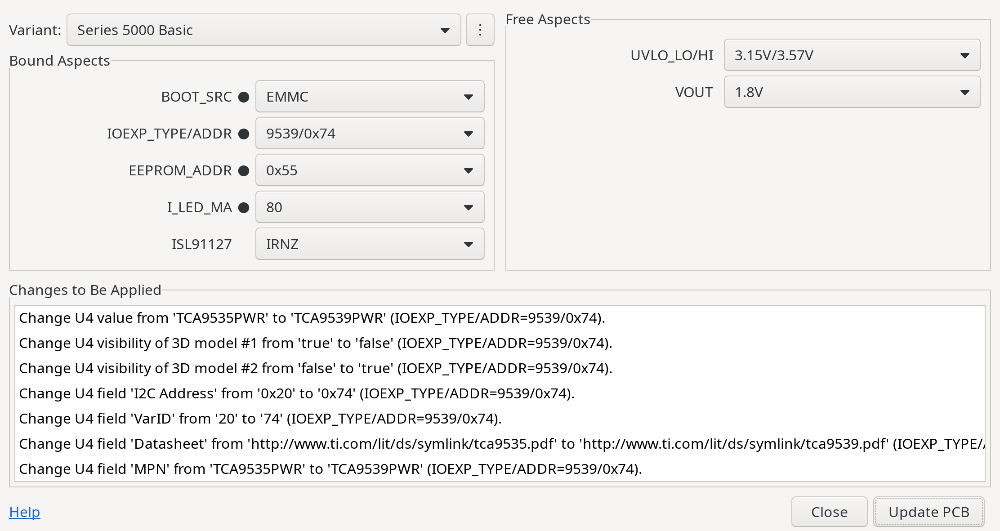
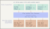
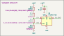

# KiVar − PCB Assembly Variants for KiCad


KiVar is a tool for **KiCad PCB Assembly Variant selection**, provided as platform-independent

 * **KiCad Plugin** and
 * **Command Line Application**.

PCB component variation rules for multiple limited design scopes are defined in component (i.e. symbol or footprint) fields.  This allows for the complete low-level variation configuration to be contained in the schematic and board files without requiring external data outside the native KiCad design.

In addition, variant definition tables (KiCad-independent CSV format) can be used to summarize the configuration of these low-level scopes in classic flat variants, which can then be switched between.

## Featured at KiCon Europe 2024

<a href='https://youtu.be/SpXH380KWUA' target='_blank'></a>

For a presentation of the **concepts** and **features** of KiVar, including a **short tutorial**, you can watch the talk ["**Managing PCB Assembly Variants with KiVar**"](https://youtu.be/SpXH380KWUA), which was recorded at KiCon Europe 2024 in Bochum, Germany.

The presentation **slides** including the embedded screencast videos can be downloaded from the [pretalx page](https://pretalx.kicad.org/kicon-europe-2024/talk/QMYVCL/).

> [!NOTE]
> The presentation covered KiVar 0.4.0, which did not yet support flat variants (added in 0.5.0).

Many thanks to Seth for the invitation.

## Features

KiVar assigns PCB component **values**, **field content**, **attributes** (such as _Do not populate_, _Not in position files_ or _Not in BoM_) and **features** (such as _individual 3D model visibility_ or _solder paste application_) according to variation rules specified in footprint fields.  When applying those rules, components are modified **in place**, allowing for immediate update of the PCB design as well as the 3D view and enabling compatibility with _any_ exporter.

Back-propagation of modified component data from the PCB to the schematic can be done in an extra step.

## What to Expect

### KiCad Plugin

Example selection dialog of the **KiVar Plugin for KiCad**:



### Command Line Interface Application

Example usage of the **KiVar Command Line Interface app**:

```
$ kivar list --selection kivar-demo.kicad_pcb 
~: 'Series 1000' 'Series 3000 Basic' ['Series 3000 Pro'] 'Series 5000 Basic' 'Series 5000 Pro'
BOOT_SRC~: EMMC JP NAND [SD]
IOEXP_TYPE/ADDR~: 9535/0x20 [9535/0x24] 9539/0x74
EEPROM_ADDR~: [0x54] 0x55
I_LED_MA~: 10 20 30 40 50 60 70 80 90 [100] 110 120 130 140 150 JP
ISL91127~: [IRAZ] IRNZ
UVLO_LO/HI: 2.41V/3.40V [3.15V/3.57V]
VOUT: 1.2V [1.8V] 2.5V 3.3V

$ kivar set --variant 'Series 5000 Pro' --verbose kivar-demo.kicad_pcb 
Changes (19):
    Change R1 'Do not populate' from 'true' to 'false' (EEPROM_ADDR=0x55).
    Change R1 'Exclude from bill of materials' from 'true' to 'false' (EEPROM_ADDR=0x55).
    Change R1 'Exclude from position files' from 'true' to 'false' (EEPROM_ADDR=0x55).
    Change R2 'Do not populate' from 'false' to 'true' (EEPROM_ADDR=0x55).
    Change R2 'Exclude from bill of materials' from 'false' to 'true' (EEPROM_ADDR=0x55).
    Change R2 'Exclude from position files' from 'false' to 'true' (EEPROM_ADDR=0x55).
    Change R21 field 'VarID' from 'A' to 'B' (I_LED_MA=110).
    Change R30 'Do not populate' from 'true' to 'false' (I_LED_MA=110).
    Change R30 'Exclude from bill of materials' from 'true' to 'false' (I_LED_MA=110).
    Change R30 'Exclude from position files' from 'true' to 'false' (I_LED_MA=110).
    Change U1 field 'I2C Address' from '0x54' to '0x55' (EEPROM_ADDR=0x55).
    Change U1 field 'VarID' from '54' to '55' (EEPROM_ADDR=0x55).
    Change U4 value from 'TCA9535PWR' to 'TCA9539PWR' (IOEXP_TYPE/ADDR=9539/0x74).
    Change U4 visibility of 3D model #1 from 'true' to 'false' (IOEXP_TYPE/ADDR=9539/0x74).
    Change U4 visibility of 3D model #2 from 'false' to 'true' (IOEXP_TYPE/ADDR=9539/0x74).
    Change U4 field 'I2C Address' from '0x24' to '0x74' (IOEXP_TYPE/ADDR=9539/0x74).
    Change U4 field 'VarID' from '24' to '74' (IOEXP_TYPE/ADDR=9539/0x74).
    Change U4 field 'Datasheet' from 'http://www.ti.com/lit/ds/symlink/tca9535.pdf' to 'http://www.ti.com/lit/ds/symlink/tca9539.pdf' (IOEXP_TYPE/ADDR=9539/0x74).
    Change U4 field 'MPN' from 'TCA9535PWR' to 'TCA9539PWR' (IOEXP_TYPE/ADDR=9539/0x74).
Board saved to file "kivar-demo.kicad_pcb".

$ kivar list --selection kivar-demo.kicad_pcb 
~: 'Series 1000' 'Series 3000 Basic' 'Series 3000 Pro' 'Series 5000 Basic' ['Series 5000 Pro']
BOOT_SRC~: EMMC JP NAND [SD]
IOEXP_TYPE/ADDR~: 9535/0x20 9535/0x24 [9539/0x74]
EEPROM_ADDR~: 0x54 [0x55]
I_LED_MA~: 10 20 30 40 50 60 70 80 90 100 [110] 120 130 140 150 JP
ISL91127~: [IRAZ] IRNZ
UVLO_LO/HI: 2.41V/3.40V [3.15V/3.57V]
VOUT: 1.2V [1.8V] 2.5V 3.3V

$ kivar check kivar-demo.kicad_pcb 
Check passed.  Matching variant and choices found for complete set of 7 aspect(s).

$ kivar state --query EEPROM_ADDR --query BOOT_SRC kivar-demo.kicad_pcb 
0x55
SD
```

The KiVar CLI application provides support for

 * setting,
 * querying,
 * listing and
 * analyzing

low-level and high-level variant data and current settings of a PCB.  It can also be used in Continuous Integration services.

## Concepts

Key concepts of KiVar are:

 * Designs may contain **multiple** independent variation **aspects** (i.e. scopes/dimensions/degrees of freedom).
 * Variation rules are **fully contained** in component fields of native design files (no external configuration files involved) and **portable** (i.e. copying components to another design keeps their variation specification intact).
 * Component values, fields, attributes and features are modified **in place** with immediate effect, enabling compatibility with all exporters that work on the actual component data.
 * **No external state information** is stored; currently matching variation choices are detected automatically.
 * Optional external **variant** definition table in independent file format (CSV) enables switching of aspect groups based on a single variant name.

## Supported KiCad Versions

KiCad Release Series | Compatible KiVar Releases
-------------------- | -------------------------
7.x                  | 0.0.1 &ndash; 0.1.2
8.x                  | 0.2.0 &ndash; _latest_
9.x                  | 0.4.2 &ndash; _latest_

KiVar currently (still) uses the SWIG-based Python bindings of pcbnew (KiCad PCB Editor).

## Installation

> [!NOTE]
> The KiCad Plugin and the CLI app can be installed independently of each other.  As the KiCad Plugin does not have external module dependencies, it does not require the CLI package to be installed.

### KiVar Plugin

The recommended plugin installation method is to use KiCad's integrated **Plugin and Content Manager**.  KiVar is included in the **official PCM repository**, allowing a smooth and safe installation and update experience.  For manual installation users can also choose to download the plugin archive package.

Required steps:

1. Start the _Plugin and Content Manager_ from the KiCad main window.
2. Find _KiVar_ in the **Plugins** section.
3. Mark it for installation and apply the pending changes.
4. The _KiVar_ plugin icon should now appear in the PCB Editor (pcbnew) toolbar.

### KiVar Command Line Application

> [!IMPORTANT]
> The KiVar CLI application requires access to the KiCad **pcbnew** Python module.  
> On _Linux_ systems, KiCad provides this module system-wide, so all Python applications with access to system packages can use it (see installation note below).  
> On _Windows_ and _macOS_, KiCad provides its own Python distribution.  In the following installation instructions, users must therefore replace `python` by the appropriate KiCad Python executable, for example `C:\Program Files\KiCad\9.0\bin\python.exe` on Windows.

interpreter in order for the CLI application to be able to access the _pcbnew_ module.  For example, on Windows, the correct Python executable may be located at ``.

#### Installation From PyPI Repository

To install (or upgrade to) the latest KiVar CLI app directly from the official KiVar PyPI repository, open a shell (see note above) and run:

```
python -m pip install --upgrade kivar
```

> [!NOTE]
> On newer _Linux_ Python installations, users might consider adding the `--break-system-packages` option for the app to be able to access KiCad's system-wide installed `pcbnew` module.

#### Installation Using a Release Archive

The KiVar CLI app can also be installed using a downloaded or locally created Python Package.

Use the following command (replace `${VERSION}` by the actual package version):

```
python -m pip install kivar-${VERSION}.tar.gz
```

> [!NOTE]
> Same note about the `--break-system-packages` option applies (see above).

## Usage

> [!IMPORTANT]
> This manual refers to the **0.5.x** series of KiVar.  If you are still using an older version, please consider [updating](#installation) KiVar and [migrating](#migrate) your variation rules.

The process of writing and assigning rules to components (i.e. symbols and footprints) is done manually using simple text expressions.

In addition, groups of configurations can be conveniently managed in tables (CSV files).

Once all relevant components are equipped with their variation rules and variant tables are set up (optionally), KiVar allows the selection of variation choices using either an easy-to-use dialog interface (when using the KiCad Plugin) or a command-line interface (when using the CLI app) and takes care of the automatic analysis and assignment of the corresponding component values, fields, attributes and features.

The following sections describe the process of configuring your schematic or board, your variant table (if desired) and - after that - selecting a variation configuration from the previously configured variation choices.  Examples are provided where appropriate.

### Component Variation Setup

While it is recommended to define variation rules in the schematic (i.e. in symbol fields) and propagate them to the board, it is also possible to define those rules directly in the board (i.e. in footprint fields) and propagate them back to the schematic.  Either way, in order for KiVar to utilize the variation rules, they must be present in the footprint fields, as KiVar uses the _pcbnew_ API wrapper and can therefore only operate on the board (not schematic) data, which must then be [propagated back to the schematic](#updating-the-schematic).

> [!TIP]
> Before diving into the more or less formal specification of KiVar variation rules, you might want to have a look at some [usage examples](#usage-examples) or the [demo project](demo/) (from which the examples are taken) for a start.  These will give you a first impression of how KiVar rules work.

> [!TIP]
> If you are already experienced with writing variation rules for older KiVar versions (especially 0.1.x), it is highly recommended to read the [KiVar Migration Guide](#migrate), which covers the most important changes introduced with newer KiVar releases.

#### Definition of Terms

Whenever specific terms appear capitalized in this document, the following definitions apply:

 * **Aspect:**  
   A scope (or dimension) of variation changes, which are defined by _Choices_ (see below).  One PCB design can refer to multiple Aspects.  Each component that makes use of KiVar variations must refer to _exactly one_ [Aspect Identifier](#aspect-identifier).  
   For example, an Aspect can be the I²C address of an EEPROM IC, using an identifier such as `EEPROM_I2C_ADDR`.
 
 * **Choice:**  
   A state of an _Aspect_.  Defined with a set of [Content](#content-specifiers) (component values or component field values) and/or [Properties](#property-specifiers) to be assigned to specific components.  A Choice is _always_ related to a specific _Aspect_ and only valid in its context.  
   For example, possible Choices for the I²C address Aspect could be `0x50`, `0x51`, `0x52`, `0x53`.

 * **Configuration:**  
   A fully defined selection of _specific_ _Choices_ for _all_ available _Aspects_.  In other words, one specific board assembly variant state.  
   An example is shown in the following section.

 * **Record:**  
   An entry in a KiVar-specific custom field of a component (symbol or footprint) to be interpreted by the KiVar rule processor.

 * **Assignment:**  
   A group of one or more Records containing [Choice Expressions](#choice-expressions) to assign a set of data to the same Assignment target (e.g. the [component itself](#component-scope), or an existing [custom field of the component](#field-scope)).

 * **Variant:**  
   A set of _Choices_ applying to a selected set of _Aspects_ (so-called _Bound Aspects_ - in contrast to _Free Aspects_, which can be modified independently of the selected Variant).  
   The use of Variants is optional.  If used, Variants are [configured independently](#top-level-variants) "on top" of the existing _Aspect_ configuration.

#### Variants

##### Multi-Scope Concept

A central point of KiVar's concepts is that one design can use any number of **independent** Aspect scopes and each scope can be switched to a specific Choice (Aspect state).

##### Flat Variants

However, in real-world projects, it is often desired to have a **single global** (i.e. top-level) switch to choose between assembly options, for example to switch between product models that always combine a specific set of assembly choices.  Most EDA tools offer this kind of "flat variant" assignment and selection feature.

##### Mixed Approach

KiVar uses a mixed approach, combining the benefits of both concepts:

The definition of Variants makes it possible to work with a single switch, while the configuration of the individual Variants is still very convenient, as it is only necessary to **switch between Choices for Bound Aspects, not between the full set of component values and attribute data**.  This additional layer of abstraction keeps Variant definitions very simple and readable.

In addition to a single Variant switch, KiVar also allows having so-called _Free Aspects_, i.e. scopes that are not modified when selecting a specific Variant.  So even after switching the main Variant, it is still possible to have a few independent switches for further assembly options, if desired.

##### Division of Resposibilities

Component value and attributes are configured in _low-level_ Aspect definitions directly in the native KiCad design files, while _top-level_ Variants are configured independently in an external table.

This makes it possible to divide the administration of each of these parts between different departments or editors, providing a _development_ and _management_ view:

While low-level Aspects can be defined by the KiCad hardware _developers_ during design, the project _manager_ can be in charge of defining model/series/product feature configurations by mapping Aspect Choices to specific Variants.  For the _management_ view, it is not even required to use an installation of KiCad (or KiVar).  A simple spreadsheet editor is sufficient to manage the Variants table.

##### Specification

Details about the specification of Variants can be found later in this manual in the [Top-Level Variants section](#top-level-variants).

#### Relation of Aspects and Choices

Each component that uses KiVar variation rules must bind to _exactly one_ variation **Aspect** to which all specified variation **Choices** for that component will then relate to.

> [!IMPORTANT]
> There may exist _multiple_ Aspects per design, and for each Aspect there may exist _multiple_ Choices.  
> One component must relate to a _single_ Aspect, but may relate to an _unlimited number_ of Choices for that Aspect.  
> Multiple components may (and usually will) refer to the same Aspects and Choices.

_Example:_

 * Design
   * Aspect `EEPROM_I2C_ADDR`
     * Choice `0x50`
     * Choice `0x51`
     * Choice `0x52`
     * Choice `0x53`
  
   * Aspect `BOOT_SRC`
     * Choice `EMMC`
     * Choice `SDCARD`
     * Choice `NAND`
  
   * Aspect `VIO_LEVEL`
     * Choice `1.8V`
     * Choice `2.5V`
     * Choice `3.3V`

One possible resulting example _Configuration_ for this design:

`EEPROM_I2C_ADDR=0x52 BOOT_SRC=NAND VIO_LEVEL=1.8V`

KiVar computes possible sets of Aspect and Choice definitions internally by checking each component's field data for KiVar [Records](#records) and the [Assignments](#assignments) resulting from them.  The structure and syntax of the expressions used in such Records are described in the following sections.

#### Records

The text expressions that describe the variation rules are noted as **Record**s, i.e. as custom field entries with each field's name containing the keyword `Var` in one of [several forms](#record-formats).

Records must appear in the component they relate to.

A usual Record contains the following elements:

 * [Assignment](#assignments) Target information: _implicit, depending on the [Assignment Scope](#assignment-scopes)_
 * [Choice Expression(s)](#choice-expressions): _one or more, depending on the [Record Format](#record-formats)_
   * [Choice Identifier List](#choice-identifier-lists): _list of affected Choice names_
   * [Choice Argument(s)](#choice-arguments): _data to be assigned to the affected Choices_
     * [Content Specifier(s)](#content-specifiers): _provide data to be used as component value or custom field value_
     * [Property Specifier(s)](#property-specifiers): _provide settings to switch component attributes or footprint features_

There is a special Aspect Specifier Record type, discussed in the [corresponding section](#aspect-identifier).

Records can use various notations, depending on their [Format](#record-formats).  Details are described in the following sections.

#### Assignments

Each Record addresses a specific target that the contained rule expressions refer to.  A group of one or more Records with the same target form an **Assignment**.

Possibe Assignment targets are:

 * the component's **value**,
 * one of the component's (custom) **fields**,
 * a component **attribute** and/or
 * a component **feature** (e.g. solder paste application, 3D representation).

#### Choice Expressions

Depending on the used [Format](#record-formats), each Record can carry either a single or multiple **Choice Expression**s.

Each Choice Expression specifies

 * for which [Choice Identifiers](#choice-identifiers) to assign
 * which data to the Record's [Assignment](#assignments) target.

For each Choice Expression, this data is passed via the

 * [Choice Identifier List](#choice-identifier-lists) and
 * [Choice Arguments](#choice-arguments).

#### Choice Arguments

The actual data to be assigned to the Choices passed as [Choice Identifier List](#choice-identifier-lists) is expressed in the **Choice Argument**s.

These Choice Arguments are a list of _space_-separated specifiers used to declare the data to be assigned to the [Assignment](#assignments) Target.

Each _Choice Argument_ inside the _Choice Argument List_ can be of one of two possible types:

 * a [**Content** Specifier](#content-specifiers) to assign a component _value_ or a specific _custom field value_, or
 * a [**Property** Specifier](#property-specifiers), e.g. to mark a component _(un)fitted_, _(not) in BoM_, _(not) in position files_ or change a dedicated footprint feature.

Argument types are distinguished by their **first (unescaped) character** and will be explained in more detail in the following sub-sections.

##### Content Specifiers

###### Purpose

One or more **Content Specifiers** can be used to form a string to be assigned to the component value or to any component custom field (such as _Manufacturer_, _MPN_, ...).

###### Syntax

Each argument beginning with a character _other than_ `-` and `+` is interpreted as a **Content Specifier**.

There may exist multiple Content Specifiers in each [Choice Argument](#choice-arguments) List.  Their values will be concatenated with one ` ` (space) character as separator to form the resulting Content string.  However, each [Assignment](#assignments) may have a maximum of _one_ resulting Content specified.  For example: `Choice1("hello world"   foo bar)` will result in `Choice1` to be assigned the content `hello world foo bar`, but multiple Content assignments to the same [Choice Identifier](#choice-identifiers), such as `Choice1("hello world") Choice1(foo bar)`, are invalid.  This restriction is due to the fact that [Records](#records) can be provided in different [Formats](#record-formats) and there is no guaranteed processing (concatenation) order.

###### Evaluation

All Content Specifiers inside the Choice Arguments are evaluated from left to right and concatenated with one space character between each argument to form the final content string to be assigned when the corresponding choice is selected.

> [!NOTE]
> As arguments can be separated by _any_ number of space characters, each separation will result in a single space character in the final content, no matter how many spaces were used for the argument separation originally (similar to HTML).  For strings that shall be assigned in a verbatim way (such as a URL), it is highly recommended to use [quoting techniques](#quoting-and-escaping).

###### Examples

The Content Specifiers in the following input Choice Argument Lists will result in the following Content strings:

Choice Argument List input | Resulting Content string | Explanation
-------------------------- | ------------------------ | -----------
`100nF`                    | `100nF`                  | Simple single arguments can be noted without [escaping or quoting](#quoting-and-escaping) as long as they don't contain certain special characters (discussed later).
`470µF 10%`                | `470µF 10%`              | Uncritical text, no verbatim adoption of the arguments required.
`470µF   10%`              | `470µF 10%`              | Multiple separator characters will be converted to a single separator. As the text is uncritical, this conversion may even be desired.
`'https://kivar.markh.de/ds/abc123.pdf'` | `https://kivar.markh.de/ds/abc123.pdf` | Strings to be used verbatim should always be enclosed in [quote](#quoting-and-escaping) characters.
`'abc   def ' 123   456`   | `abc   def  123 456`     | Mixed type of quoted and unquoted representation.  Note how the trailing space after `def` remains contained in the result.
`abc "def 'ghi' jkl" mno`  | `abc def 'ghi' jkl mno`  | Outer double quotes encapsulate inner single quotes, which are part of the verbatim string.
`abc 'def "ghi" jkl' mno`  | `abc def "ghi" jkl mno`  | Outer single quotes encapsulate inner double quotes, which are part of the verbatim string.
`abc \d\e\f\ \ ghi\'jkl\\mno` | `abc def  ghi'jkl\mno` | [Escaping](#quoting-and-escaping) (prepending a backslash) ensures that the following character is interpreted verbatim, not as a special character.  To create a backslash (the escape character) string, use a double backslash (i.e. escape the backslash).
`\+10% \-5% \-12V \+5V`    | `+10% -5% -12V +5V`      | If the first character of a Content Specifier is a `-` or `+`, the corresponding Choice Argument must be prepended with a backslash (`\`) character or be part of a verbatim string (see next example).
`"+10%" '-5%' "-"12V '+'5V` | `+10% -5% -12V +5V`     | If the first character of a Content Specifier is a `-` or `+`, the corresponding Choice Argument must be part of a verbatim string or be prepended with a backslash (`\`) character (see previous example).

##### Property Specifiers

###### Purpose

KiVar provides a set of boolean component _Properties_ that allow controlling the component attributes

 * **Do not Populate**,
 * **Not in Position Files**, and
 * **Not in BoM**
 
as well as component features, such as

 * **Individual 3D Model Visibility** and
 * **Solder Paste Application**.

###### Syntax

Each argument beginning with a `-` or `+` is interpreted as a **Property Specifier**, which is a combination of **Property Modifiers** and **Property Identifiers**.

Each Property Specifier must start with a _Property Modifier_, defining the boolean state (_true_ or _false_, represented by `+` or `-`, respectively) to be assigned to the Properties subsequently specified by their corresponding _Property Identifiers_.

###### Evaluation

All Property Specifiers inside a [Choice Argument List](#choice-arguments) are evaluated from left to right, resulting in a set of defined boolean Property states for the corresponding component and Choice.  Properties _not_ defined in _any_ of the component's Choices are kept in their original state.

###### Attribute Properties

The following Properties allow modification of component _attributes_:

 * **Fit** (Property identifier `f`).  
   This Property specifies whether a component shall be fitted (Property state _true_) or unfitted (Property state _false_).  This Property is linked to the pcbnew footprint attribute _Do not populate_ with inverted polarity.
 * **Pos** (Property identifier `p`).  
   This Property specifies whether a component shall be included in the component placement/position files (Property state _true_) or excluded (Property state _false_).  This Property is linked to the pcbnew footprint attribute _Not in Position Files_ with inverted polarity.
 * **Bom** (Property identifier `b`).  
   This Property specifies whether a component shall be included in the Bill of Materials (Property state _true_) or excluded (Property state _false_).  This Property is linked to the pcbnew footprint attribute _Not in BoM_ with inverted polarity.

###### Feature Properties

Additionally, the following Properties allow controlling footprint _features_:

 * **Model** (Property identifier `mN`, with `N` being an integer number).  
   This Property controls the visibility of each individual 3D model of the corresponding component footprint to either visible (Property state _true_) or invisible (Property state _false_).  An integer number must be provided directly following the first character of the Property identifier, representing the index of the model to be shown or hidden.  The index starts at 1.
 * **Solder** (Property identifier `s`).  
   This Property controls the application of solder paste to the pads of a component's footprint.  Solder paste can be enabled (Property state _true_) or disabled (Property state _false_).  For both cases, user-defined footprint-specific solder paste clearances are maintained (see note below).  
   _Important:_ As usual for KiCad solder paste clearance settings, this Property has only effect for pads on copper layers, but _not_ for _SMD Aperture_ pads!

> [!IMPORTANT]
> For indexed Properties, i.e. Properties including an integer index value, each index is treated as an individual and independent Property.  For example, the Properties _Model#1_ and _Model#2_ do not affect each other.  This independence also applies to [Default Property Inheritance](#default-property-inheritance) and [Implicit Property Defaults](#implicit-property-defaults) discussed below.

> [!NOTE]
> As KiCad does not provide a dedicated footprint attribute for suppressing solder paste application, KiVar instead makes use of the _solder paste relative clearance_ value.  To disable or enable solder paste application for a footprint, KiVar applies or removes negative offset values to/from that clearance value.  This technique allows almost transparent operation and retaining user-provided clearance values.  However, in order to ensure safe classification of KiVar-applied solder paste clearance control, those user-provided relative clearance values must be in the range from &minus;10,000% to &plus;10,000%.

###### Group Properties

The following Property allows grouping frequently used attribute properties for user convenience:

 * **Assemble** (Property identifier `!`).  
   This Group Property represents all three attribute properties **Fit**, **Pos** and **Bom** (`f`, `p`, `b`).  It can be used as a shortcut, as most of the times all three attributes are controlled together and set to the same state when a component is switched between _assembled_ or _unassembled_.  However, if finer control is desired, the state of individual attribute properties can still be overridden.  Examples can be found in the next section.

###### Examples

The Property Specifiers in the following input Choice Argument Lists will result in the following Property states:

Choice Argument List input | Resulting Property states  | Explanation
-------------------------- | -------------------------- | -----------
`-f`                       |  _not_ Fit                 | The `-` causes _false_ to be assigned to the subsequent properties, i.e. _Fitted_.  The footprint's attribute _Do not populate_ will be set to _true_.
`-fbp`                     |  _not_ Fit, _not_ Bom, _not_ Pos | One modifier (`-`) can be used for any number of subsequent identifiers.
`-!`                       |  _not_ Fit, _not_ Bom, _not_ Pos | Equivalent to prior example.
`+!`                       |  Fit, Bom, Pos             | Place this component to the board, include it in the BoM and in position files.
`-! +b`                    |  _not_ Fit, Bom, _not_ Pos | After setting `f`, `b`, `p` to false, `b` is set to true again.  Useful if you want your BoM to include unfitted parts, that are otherwise marked "DNP".
`-!+b`                     |  _not_ Fit, Bom, _not_ Pos | Equivalent to prior example.  Multiple modifiers may appear inside a single specifier argument.
`-s`                       |  _not_ Solder              | Remove solder paste from the component's footprint SMD pads.
`-!s`                      |  _not_ Fit, Bom, _not_ Pos, _not_ Solder | Do not assemble component, and remove solder paste from its footprint.
`+m1-m2`                   |  _not_ Model#1, Model#2    | Show first 3D model, hide second one.
`-m1m2m3 +m4`              |  _not_ Model#1, _not_ Model#2, _not_ Model#3, Model#4 | Hide first three 3D models, show fourth one.

#### Choice Identifiers

##### Purpose

Each Choice must have a unique name within its Aspect scope.  This name can be any string.

For referring to a Choice name, **Choice Identifiers** are used.  They are basically the same as the name itself, but rules for [quoting and escaping](#quoting-and-escaping) of special characters apply.  Choice Identifiers are **case-sensitive**.

The reserved Choice identifiers `?` and `*` can be used to assign template data to Choices not defined or not fully defined, respectively, for the corresponding assignment.  For details, refer to the [Stand-In Choice](#stand-in-choice) and [Default Choices](#default-choice) sections below.

##### Declaration and Definition

KiVar uses implicit declaration of Choice Identifiers.

That is, adding a new Choice to an Aspect is simply done by using (i.e. mentioning) the Choice Identifier in any Assignment's Choice Expression.  This will cause the Choice to be created (if it's new) or extended (if it matches an existing one).

It is therefore important to pay attention to correct spelling of Choice Identifiers, so that they can be correctly allocated.

##### Choice Identifier Lists

When using Choice Identifiers in Choice Expressions, those identifiers can always be specified as **Choice Identifier Lists**.  A Choice Identifier List consists of **one or more** Choice Identifiers separated by `,` (comma) characters (e.g. `ChoiceId_1,ChoiceId_2,ChoiceId_3`).  No space is allowed around the separating comma.

##### Special Choice Identifiers

To follow the ["All-or-None" rule](#fully-defined-assignments-the-all-or-none-rule), Content and Property assignments must be defined for _all_ choices involved if at least one assignment is defined.

Defining all Choices for each Assignment would require each Choice Identifier to be explicitly listed along with its corresponding Content or Property specifications.  Also, any modification of available Choice Identifiers (i.e. adding, removing, renaming Choices) in _one_ component would (that is, _will_) require the Choice Expressions of all components in the same Aspect scope to be adapted as well.

To avoid having to explicitly list all possible Choice Identifiers for each assignment, **Default Choices** and **Stand-In Choices** are available.  The Content and Properties specified for Default and Stand-In Choices apply as described in the following sections.

##### Stand-In Choice

###### Purpose

Data assigned to a Stand-In Choice is used for all specific Choices that remain _undefined_ (i.e. not mentioned) in the corresponding Assignment.

Stand-In Choice data is _not_ used for specific Choices that have _empty_ definitions.

Stand-In Choices are particularly useful to assign data to "all other" Choices without explicitly mentioning them, or to make use of [Implicit Property Defaults](#implicit-property-defaults), which would be overridden by specifying a [Default Choice](#default-choice).

###### Syntax

The reserved Choice Identifier used for Default Choices is "`?`".

###### Stand-In Data Inheritance

Data assigned to a Stand-In Choice is used for specific Choices that are declared in _other_ Assignments, but are _undefined_ in the Assignment for which the Stand-In Choice is defined.

##### Default Choice

###### Purpose

Data (Content or Properties) assigned to a Default Choice is used as a baseline for the data assigned to _all_ specific Choices (defined or undefined) for the Assignment in which the Default Choice is defined.

Default Choice **Content** (if any) is used for all specific Choices that do not provide their own Content or that are undefined.

Default Choice **Properties** (if any) are used as base data before applying Property data from specific Choices definitions.  Undefined Choices inherit the Default Choice's Properties.

###### Syntax

The reserved Choice Identifier used for Default Choices is "`*`".

###### Default Content Inheritance

For each Assignment target, the Content (component value or field content, respectively) specified in the Default Choice applies to all Choices that **do not provide** their own Content definition for the same Assignment.

The following table explains Content inheritance rules using an example Choice Identifier `A` and some example Content.

Default Choice (`*`) Content | Specific Choice (`A`) Content | Resulting Specific Choice (`A`) Content
---------------------------- | ----------------------------- | ---------------------------------------
_(none)_                     | _(none)_                      | _(none)_
_(none)_                     | `123`                         | `def`
`abc`                        | _(none)_                      | `abc`
`abc`                        | `123`                         | `123`

###### Default Property Inheritance

For each Assignment target, the state of each Property specified in the Default Choice is used as the **initial value** for _all_ Choices with the same Assignment target.

The following table explains Property state inheritance rules using an example Choice Identifier `B` and some example Property states (with resulting Property states listed with [Property Specifier](#property-specifiers) syntax).

Default Choice (`*`) Property Specifiers | Specific Choice (`B`) Property Specifiers | Resulting Specific Choice (`B`) Property states
---------------------------------------- | ----------------------------------------- | -----------------------------------------------
_(none)_                                 | _(none)_                                  | _(none)_
_(none)_                                 | `+f`                                      | `+f`
`+f`                                     | _(none)_                                  | `+f`
`+!`                                     | _(none)_                                  | `+fbp` _([&rarr; group](#group-properties))_
`+!`                                     | `-p`                                      | `+fb` `-p`
`+f`                                     | `-b`                                      | `+f` `-b`
`+f +b`                                  | `-b`                                      | `+f` `-b`
`-s!`                                    | `+s`                                      | `-fbp` `+s`
`-m1m2m3`                                | `+m3`                                     | `-m1` `-m2` `+m3`

##### Stand-In vs. Default Choices

While Stand-In and Default Choices act similarly, users should be aware of the following differences between them.

###### Effectiveness

 * **Stand-In** data is only used for Choices that are declared elsewhere, but are not defined (not even with an empty definition) for the Assignment.
 * **Default** data is used as a basis for _all_ Choices of the Assignment and only overridden by specific Choice data.  Empty definitions inherit the unaltered Default Choice data, as they do not override any data.

###### Granularity

 * **Stand-In** data is used as a whole (all Content and Properties), depending on the _presence of the definition_ for a corresponding specific Choice, while
 * **Default** data is used as a baseline and can be overridden on a per-element basis (Content or Properties) by the corresponding specific Choice.

###### Order of Application

First, Stand-In data is assigned to all undefined Choices.  After that, Default Choice data is used for all resulting Choice data as usual.

That is, Stand-In and Default Choices can be used at the same time and Default Data applies to all (resulting) Choice definitions in any case.

###### Utilization of Implicit Property Defaults

As Stand-In Choice data is only used for undefined Choices, it can be used for the calculation of Implicit Property Default data.

##### Implicit Property Defaults

For Property states **Implicit Property Defaults** may apply.

For each Assignment target, whenever only _one_ state (i.e. _either_ `+` _or_ `-`) is assigned to a given Property by any number of Choices, then the **opposite** state is used for this Property as the _Implicit Default State_ for that Assignment.

> [!NOTE]
> The Implicit Default can be imagined as a "Default Default" state of a Property.  That is, the _Implicit_ Default state of a Property will be **overridden** by a state specified in an _explicit_ (usual) [Default Choice](#default-choice).

The following table explains Implicit Property Default state inheritance rules using the example Choice Identifiers `C1`, `C2`, `C3`.  `C3` is not defined, but declared by another Assignment.  Hence `C3`'s Property states ("PS") will be assigned the values found in the Assignment's _Implicit Default PS_ (as computed by analysis of all defined Choices, i.e. `C1` and `C2`) and the user-provided (explicit) _Default (`*`) PS_ (overriding Implicit Default values, per Property).  Resulting Property states ("RPS") for all Choices `C1`, `C2`, `C3` are listed with [Property Specifier](#property-specifiers) syntax.

Choice `C1` PS | Choice `C2` PS | Implicit Default PS                                      | Default (`*`) PS | `C1` RPS  | `C2` RPS  | `C3` RPS
-------------- | -------------- | -------------------------------------------------------- | ---------------- | --------- | --------- | ---------
_(none)_       | _(none)_       | _(none)_                                                 | _(none)_         | _(none)_  | _(none)_  | _(none)_
`+f`           | _(none)_       | `-f` _(opposite of C1)_                                  | _(none)_         | `+f`      | `-f`      | `-f`
`+f`           | `+f`           | `-f` _(opposite of C1/C2)_                               | _(none)_         | `+f`      | `+f`      | `-f`
`+f`           | `-f`           | _(none)_ _(C1/C2 contradicting)_                         | _(none)_         | `+f`      | `-f`      | _(none)_ (Invalid! `f` missing!)
`+f`           | `-f`           | _(none)_                                                 | `-f`             | `+f`      | `-f`      | `-f`
`+f`           | `-p`           | `-f` `+p`                                                | _(none)_         | `+f` `+p` | `-f` `-p` | `-f` `+p`
`-!`           | _(none)_       | `+fbp` _([&rarr; group](#group-properties))_             | _(none)_         | `-fbp`    | `+fbp`    | `+fbp`
`-!`           | `-p`           | `+fbp`                                                   | _(none)_         | `-fbp`    | `+fb` `-p`| `+fbp`
`+f`           | _(none)_       | `-f`                                                     | `+b`             | `+f` `+b` | `-f` `+b` | `-f` `+b`
`-!`           | `+p`           | `+fb` _(`p` of C1/C2 contradicting)_                     | _(none)_         | `-fbp`    | `+fb` `+p`| `+fb` (Invalid! `p` missing!)
`-!`           | `+p`           | `+fb`                                                    | `-p`             | `-fbp`    | `+fb` `+p`| `+fb` `-p`
`-s`           | `+!`           | `-fbp` `+s`                                              | _(none)_         | `-fbps`   | `+fbps`   | `-fbp` `+s`
`+m1`          | `+m2`          | `-m1m2`                                                  | _(none)_         | `+m1` `-m2` | `-m1` `+m2` | `-m1m2`

#### Assignment Scopes

The data defined for an Assignment can be applied to either

 * the component's basic elements (i.e. component _value_, _attributes_, _features_), or to
 * component custom fields (such as _Manufacturer_, _MPN_, ...).

For each of them there exists a dedicated **Assignment Scope**.  Both scopes are explained in the following sub-sections.

##### Component Scope

###### Purpose

Assignments in **Component Scope** are used to assign basic component **values**, such as `10kΩ`, `0.1µF 50V` or `74HC595`, to the "Value" field of a component (i.e. symbol or footprint), passed via [Content Specifiers](#content-specifiers).

Also, the Component Scope is used to modify component **attributes**, for example the _DNP_ (Do Not Populate), _Exclude from Position Files_ and/or _Exclude from BoM_ states (attributes) of a component, or dedicated component/footprint **features**, for example controlling 3D model visibility or solder paste application.  Component attributes and features are modified using [Property Specifiers](#property-specifiers).

> [!IMPORTANT]
> Assignments in the Component Scope can _not_ modify **custom fields** (i.e. other than "Value").  For this, the [Field Scope](#field-scope) must be used (see next section).

Examples using the Component Scope are discussed later in the [SCAR](#simple-component-assignment-records-scar) and [CCAR](#combined-component-assignment-records-ccar) sections.

##### Field Scope

###### Purpose

Assignments in **Field Scope** are used to assign Content to **custom fields**, such as the manufacturer name or the manufacturer product number (MPN), for example, to be used in the bill of materials.  Other usual component fields to be modified are tolerance ranges, voltage rating, or the datasheet URL.

For documentation purposes, essential components may be assigned information about the currently selected Aspect Choice, such as a component's selected bus address or some bootstrap configuration settings.  This data can then be made visible anywhere in the schematic and even in the PCB.  This enables automatically updated documentation.

> [!IMPORTANT]
> Field Scope Assignments do _not_ support specifying Properties.

> [!IMPORTANT]
> Target fields referenced by Assignments in the Field Scope _must_ already exist.

> [!NOTE]
> The target field names "Footprint", "Reference" and "Value" are not permitted (to change the component value, the [Component Scope](#component-scope) must be used).

Examples using the Field Scope are discussed later in the [SFAR](#simple-field-assignment-records-sfar) and [CFAR](#combined-field-assignment-records-cfar) sections.

#### Record Formats

Furthermore, Assignment Records can use different notations, depending on the user's preferences and requirements.

Both available **Record Formats** are described in the following sub-sections.

##### Simple Format

###### Purpose

The **Simple Format** is particularly well suited to

 * specify a part of an [Assignment](#assignments) containing
 * a _single_ [Choice Expression](#choice-expressions) using
 * one dedicated [Record](#records).

###### Typical Use

Records noted in Simple Format

 * are recommended for longer, more complex (or verbatim) Content, such as a datasheet or purchase URL or a complex "Value" field content,
 * can be useful when referencing a dedicated set of Choice Arguments using text variables that are embedded in another location of the schematic (see examples),
 * have the drawback that - due to the diversity of the symbol field names they occupy - each unique used field name adds to the list of field names available in total, which "pollutes" the fields list, e.g. in the Symbol Fields Editor.

Examples using the Simple Format are provided in the [SCAR](#simple-component-assignment-records-scar) and [SFAR](#simple-field-assignment-records-sfar) sections.

##### Combined Format

The **Combined Format** is particularly well suited to

 * specify one or more parts of an [Assignment](#assignments) containing
 * one or more [Choice Expression](#choice-expressions),
 * optionally including the [Aspect Identifier](#aspect-identifier) (only in [Component Scope](#component-scope)), using
 * one dedicated [Record](#records).

###### Typical Use

Assignments noted in Combined Format

 * are recommended for shorter, simpler Content, such as a simple component Value, a short MPN or manufacturer name,
 * allow specifying multiple Choice Expressions in a compact way,
 * therefore save a lot of Records (and field adding/typing work) when many Choices need to be declared or defined.

Examples using the Combined Format are provided in the [CCAR](#combined-component-assignment-records-ccar) and [CFAR](#combined-field-assignment-records-cfar) sections.

#### Assignment Record Types

The four available **Assignment Record Types** are the result of using both [Assignment Scopes](#assignment-scopes) in combination with both [Record Formats](#record-formats) as discussed in the following sub-sections.

##### Simple Component Assignment Records (SCAR)

###### Typical Use

Using the [Component Scope](#component-scope), **Simple Component Assignment Record**s define the component's Value content and/or component attributes and features with [Content](#content-specifiers) and [Property](#property-specifiers) specifiers noted in the [Simple Format](#simple-format).

###### Record Elements

**Field name**: `Var(<CIL>)`

**Field content:** `<CAL>`

Used placeholders:

 * `<CIL>` specifies the [Choice Identifiers List](#choice-identifiers).
 * `<CAL>` specifies the corresponding [Choice Arguments List](#choice-arguments).

###### Examples

The following entries could be used for a capacitor.  Note how the Aspect Identifier must be passed with a dedicated entry, because [SCARs](#simple-component-assignment-records-scar) cannot include the Aspect Identifier, as is possible for [CCARs](#combined-component-assignment-records-ccar).

Field name            | Field content
--------------------- | -------------
`Var.Aspect` \*       | `Capacitance`
`Var(Low)`            | `10µF`
`Var(Medium)`         | `100µF`
`Var(High)`           | `470µF`
`Var(None,?)`         | `-! DNP`

\* This defines an Aspect Identifier _"Capacitance"_ including (at least, depending on the definitions used in other components) the Choice Identifiers _"Low"_, _"Medium"_, _"High"_, which define capacitance values, as well as _"None"_, which assigns the (capacitance) value `DNP` and also makes the component unfitted and excluded from position files and BoM.

> [!NOTE]
> In the above example, the Stand-In Choice Identifier _"?"_ is added to the _"None"_ Choice, so that the corresponding expression also applies to any Choices declared outside this component in the same Aspect context.  
> Applying Stand-In data to Choices that the current component or assignment is "unaware" of may or may not be a good idea, depending on the chosen convenience vs. safety ratio.

##### Combined Component Assignment Records (CCAR)

###### Typical Use

Using the [Component Scope](#component-scope), **Combined Component Assignment Record**s define the component's Value content, component attributes and features and/or the Aspect Identifier with [Content](#content-specifiers) and [Property](#property-specifiers) specifiers noted in the [Combined Format](#combined-format).

###### Record Elements

**Field name**: `Var`

**Field content:** `[<ASPECT_ID> ]<CIL_1>(<CAL_1>)[ <CIL_2>(<CAL_2>)[ ...[ <CIL_N>(<CAL_N>)]]]`

Used placeholders:

 * `<ASPECT_ID>` (optional) specifies the [Aspect Identifier](#aspect-identifier).
 * `<CIL_1>` .. `<CIL_N>` specify the [Choice Identifiers Lists](#choice-identifiers).
 * `<CAL_1>` .. `<CAL_N>` specify the corresponding [Choice Arguments Lists](#choice-arguments).

> [!NOTE]
> The [Aspect Identifier](#aspect-identifier) can be passed at _any_ element position within the Combined Expression (first or last position recommended for readability).

###### Examples

The following single entry serves the same purpose as the above [SCAR](#simple-component-assignment-records-scar) example.  Note how even the [Aspect Identifier](#aspect-identifier) is included in the same single Assignment.

Field name     | Field content
-------------- | -------------
`Var`          | `Capacitance Low(10µF) Medium(100µF) High(470µF) None,?(-! DNP)`

The same explanation applies as for the above [SCAR](#simple-component-assignment-records-scar) example.

##### Simple Field Assignment Records (SFAR)

###### Typical Use

Using the [Field Scope](#field-scope), **Simple Field Assignment Record**s define the Content of a specified _existing_ component field with [Content Specifiers](#content-specifiers) noted in the [Simple Format](#simple-format).

###### Record Elements

**Field name**: `<TARGET_FIELD_NAME>.Var(<CIL>)`

**Field content:** `<CAL>`

Used placeholders:

 * `<TARGET_FIELD_NAME>` specifies the name of the component's field to assign specified Content to.
 * `<CIL>` specifies the [Choice Identifiers List](#choice-identifiers).
 * `<CAL>` specifies the corresponding [Choice Arguments List](#choice-arguments).

###### Examples

The following entries could be used to define the MPN, description and datasheet URL for an imaginary LDO component.  Note that the target field names "Description", "MPN" and "Datasheet" must exist.

Field name                    | Field content
----------------------------- | -------------
`Var.Aspect`                  | `Voltage`
`Description.Var(1.8V)`       | `Fixed voltage 1.8V 200mA LDO`
`Description.Var(3.3V)`       | `Fixed voltage 3.3V 200mA LDO`
`Description.Var(adjustable)` | `Adjustable voltage 200mA LDO`
`MPN.Var(1.8V)`               | `ALDO200V18`
`MPN.Var(3.3V)`               | `ALDO200V33`
`MPN.Var(adjustable)`         | `ALDO200ADJ`
`Datasheet.Var(1.8V,3.3V)`    | `"https://example.kivar.markh.de/products/aldo200v.pdf"`
`Datasheet.Var(adjustable)`   | `"https://example.kivar.markh.de/products/aldo200a.pdf"`

This defines the Choice Identifiers _"1.8V"_, _"3.3V"_ and _"adjustable"_ (inside the Aspect _"Voltage"_), which define different field content for the target fields _"Description"_, _"MPN"_ and _"Datasheet"_.  Note how this example does not make use of the Stand-In or Default Choice Identifiers _"*"_ or _"?"_, respectively, as there are no sensible defaults that could be assigned for yet unknown Choices that may be declared by other components.

##### Combined Field Assignment Records (CFAR)

###### Typical Use

Using the [Field Scope](#field-scope), **Combined Field Assignment Records**s define the Content of a specified _existing_ component field with [Content Specifiers](#content-specifiers) noted in the [Combined Format](#combined-format).

###### Record Elements

**Field name**: `<TARGET_FIELD_NAME>.Var`

**Field content:** `<CIL_1>(<CAL_1>)[ <CIL_2>(<CAL_2>)[ ...[ <CIL_N>(<CAL_N>)]]]`

Used placeholders:

 * `<TARGET_FIELD_NAME>` specifies the name of the component's field to assign specified Content to.
 * `<CIL_1>` .. `<CIL_N>` specify the [Choice Identifiers Lists](#choice-identifiers).
 * `<CAL_1>` .. `<CAL_N>` specify the corresponding [Choice Arguments Lists](#choice-arguments).

###### Examples

The following few entries serve the same purpose as the above [SFAR](#simple-field-assignment-records-sfar) example.

Field name              | Field content
----------------------- | -------------
`Var.Aspect`            | `Voltage`
`Description.Var`       | `1.8V(Fixed voltage 1.8V 200mA LDO) 3.3V(Fixed voltage 3.3V 200mA LDO) adjustable(Adjustable voltage 200mA LDO)`
`MPN.Var`               | `1.8V(ALDO200V18) 3.3V(ALDO200V33) adjustable(ALDO200ADJ)`
`Datasheet.Var`         | `1.8V,3.3V("https://example.kivar.markh.de/products/aldo200v.pdf") adjustable("https://example.kivar.markh.de/products/aldo200a.pdf")`

The same explanation applies as for the above [CFAR](#combined-field-assignment-records-cfar) example.

#### Aspect Identifier

##### Purpose

To define to which Aspect (i.e. group/dimension/degree of freedom) all of the component's Choice Identifiers relate to, an **Aspect Identifier** must be specified for each component that makes use of KiVar Assignments.

##### Declaration and Definition

Similarly to [Choice Identifiers](#choice-identifiers), KiVar uses implicit declaration of Aspect Identifiers.

That is, adding a new Aspect to a design is simply done by using (i.e. mentioning) the Aspect Identifier in an Aspect Specifier (see below for possible methods).  This will cause the Aspect to be created or extended (if it matches an already existing one).

It is therefore important to pay attention to correct spelling of Aspect Identifiers, so that they can be correctly allocated.

##### Specification

There are two methods of specifying the **Aspect Identifier**:

1. Using a dedicated Record in the _component field_ `Var.Aspect`, or
2. as part of a [_Combined Component Assignment Record_](#combined-component-assignment-records-ccar).

Details and examples can be found in the following sections.

<a name="all-or-none"></a>

#### Fully Defined Assignments (The "All-or-None" Rule)

##### Purpose

One of the key concepts of KiVar requires all Configurations (i.e. sets of Choice selections) to be unambiguous regarding their outcome (component values/fields/attributes/features).  This is required in order to be able to detect, i.e. map the assigned outcome back to an unambiguous set of Choices.

For each Assignment it is therefore required that for the **Content** and for **each specific Property**, respectively, there is

 * either **no definition** for **any** Choice (i.e. Content or the specific Property's state, respectively, is kept in its original state)
 * or a **dedicated definition** for **every** Choice (i.e. Content or the specific Property's state is assigned defined data).

It is not allowed to provide only a sparse set of definitions for each Assignment element (Content or Property), unless [Stand-In](#stand-in-choice) or [Default](#default-choice) Choice definitions are provided to fill the undefined parts.  Sparse definitions are forbidden as they would lead to inconsistent states when switching Choices.

In short, assignments must be done for **either none or all** Choices.

> [!NOTE]
> The KiVar rule processor will notify you with an error if sparse definitions are detected.

#### Quoting and Escaping

**Special characters** inside an Assignment, such as `,` ` ` `-` `+` `(` `)` (comma, space, dash/minus, plus, parentheses) are **not** considered special (i.e. do not act as separators or Property Modifiers) if

 * they appear inside a quoted part of the expression, i.e. inside a matching pair of two unescaped `'` (single quotation mark) or `"` (double quotation mark) characters, or when
 * they are escaped, i.e. directly prepended with a `\` (backslash).

Single and double quotation mark characters (`'` and `"`) can be nested, in which case the inner quotation marks will become part of the verbatim string.

To include any character as-is without being interpreted as special character (e.g. `-` or `+` to be used as first character of a Content string, or a _quotation mark_ or _backslash_), that character must be _escaped_, i.e. preceded, with a _backslash_ character.

> [!TIP]
> For many cases, quoting and escaping in KiVar works just like in a regular POSIX shell interpreter.

> [!TIP]
> As long as they come in pairs and in the correct nesting order, parentheses (`(` and `)`) are not required to be escaped or quoted, as the expression parser can handle multiple levels of properly nested parentheses.  For example, `Choice_1(100nF (10%))` is fine, even without quoting or escaping.  Unusual arrangements, however, may require quoting or escaping in order to avoid misinterpretation by the parser.

_Examples:_

* To assign the fictional value `don't care` (a string containing a single quotation mark and a space) as a _single_ argument, the appropriate Content Argument in the Choice Expression would be either `'don\'t care'`, `"don't care"`, or `don\'t\ care`.
* To use `+5V` (a string starting with a plus) as a value, the choice definition arguments `'+5V'` or `\+5V` would be appropriate.  If the plus were not escaped, `+5V` would be interpreted as an (invalid) [Property Specifier](#property-specifiers).
* To assign an empty Content string (e.g. component value or target field content), use an empty quoted string (`''` or `""`) as [Content Specifier](#content-specifiers).
* To assign a list of simple words or values as Content (e.g. value specifications such as `47µF 35V 10% X7R`), the Content Specifiers can be naturally listed without quoting or escaping.
* To keep consecutive space characters, they must be escaped or quoted, e.g. to assign the Content string `three   spaces` the Content Specifier `three\ \ \ spaces`, `"three   spaces"` or `three'   'spaces` could be used.

> [!NOTE]
> The same quoting and escaping rules apply for Aspect and Choice Identifiers.

#### Expression Processing Example

The following figure illustrates the processing of some example Assignments using [Combined Component Assignment Records](#combined-component-assignment-records-ccar).



#### Usage Examples

The following examples are mostly taken from real commercial projects.  They show a few configurable variation Aspects, their possible Choices along with a short explanation of the used Assignments.

To further explore these examples and learn the recommended ways of implementing KiVar rule expressions, check out the [demo project](demo/).

In the following sections, each example is illustrated with a schematic snippet including the values of the relevant fields for each related symbol.

##### Example 1: I²C Device Address Selection

In this very simple example, KiVar is used to conveniently select the address of an I²C device.  Address input signal A0 switches between device addresses 0x54 _(A0=GND)_ and 0x55 _(A0=+3V3)_.


The device address is selected by tying the IC input A0 to either GND or +3V3, depending on the selected choice.  Inputs A1 and A2 are tied to fixed levels for the sake of simplicity.

How to read the rules:

 * Variation Aspect Identifier is `EEPROM_ADDR` (with Choice `0x55` currently applied in the figure).
 * **R1**: For Choice `0x55` this part will be fitted (`+!`, resolving to `+fpb`).  There is no [Stand-In](#stand-in-choice) or [Default](#default-choice) Choice required, as [Implicit Property Defaults](#implicit-property-defaults) (opposite property states, i.e. `-fpb`) are assumed automatically.
 * **R2**: Likewise, for Choice `0x54` this part will be fitted, else unfitted (same explanation as for R1).
 * **U1**: A purely informational field called `I2C Address` is assigned the value `0x54` or `0x55`, depending on the Choice.  This field can then either be made visible directly, or referenced by other symbols or text boxes within the schematic (using text variable `${U1:I2C Address}`).

This example uses only [Combined Format](#combined-format) Records.

> [!TIP]
> Text information as used by **U2** lets KiVar annotate your schematic automatically with details like selectable device bus addresses, which is really useful for documentation purposes.

##### Example 2: Boot Source Selection

This schematic snippet is used for the boot source device selection for an NXP i.MX6ULL SoC.


The variation Choices provide selection between the boot sources `EMMC`, `SD` and `NAND`, as well as an extra Choice `JP`, (which leaves _all_ configuration resistors unfitted, so that the user can configure the board by manually shorting the solder bridges JP1, JP2, JP3).

How to read the rules:

 * Variation Aspect Identifier is `BOOT_SRC` (with Choice `EMMC` currently applied in the figure).
 * **R9**: For Choices `NAND` and `JP` this part is unfitted, else (`SD` and `EMMC`, handled by [Implicit Property Defaults](#implicit-property-defaults)) fitted.  
 * **R10**: For Choices `SD`, `EMMC` and `JP` this part is unfitted, else (`NAND`) fitted.
 * **R11**: For Choices `SD`, `NAND` and `JP` this part is unfitted, else (`EMMC`) fitted.

> [!NOTE]
> **R9** also contains a purely informational field _"ChoiceText"_, which is assigned a readable description of the selected boot device.  That field is then referenced in a text element with the string: `Selected Boot Source: <${R9:ChoiceText}>`.  The corresponding variation rule field (`ChoiceText.Var`) is not visible for the sake of clarity.

> [!NOTE]
> The Aspect Identifier is specified in a dedicated field for each involved component, so that the (visible) Records can be kept short.  
> The Aspect Identifier field (`Var.Aspect`) is kept invisible, except for component R9, from where it is moved to the top of the figure for documentation purposes.  

> [!TIP]
> In the Schematic Editor, uncheck the "Allow automatic placement" option for manually positioned symbol fields.

This example uses only [Combined Format](#combined-format) Records.

##### Example 3: Undervoltage Trip Points

Typical use-cases for variations are resistor divider networks, such as voltage regulator feedback dividers or — in this case — a voltage divider with two taps for a programmable hysteresis on an undervoltage lock-out (UVLO) circuit.



The used variation Aspect defines all four resistors (only two of them with varying values), allowing to select the lower (cut-off) and higher (recovery) voltage limits for the supply voltage monitor IC.

How to read the rules:

 * Variation Aspect Identifier is `UVLO_HYST` (with Choice `3.15V/3.57V` currently applied in the figure).
 * **R12**: For Choice `2.41V/3.40V` the value is `0Ω`, for Choice `3.15V/3.57V`, the value is `309kΩ`.
 * **R13**: The value is always (i.e. for all Choices not explicitly mentioned in this Assignment) set to `1MΩ`.  It is not really required to apply a value or to use a variation rule for this symbol at all.  However, in case more Choices are added in the future, it is very likely that the value of this resistor will change.  Hence the resistor symbol has the rule entry already prepared for easy introduction of new Choices.
 * **R14**: For Choice `2.41V/3.40V` the value is `309kΩ`, for Choice `3.15V/3.57V`, the value is `100kΩ`.
 * **R15**: The value is always set to `750kΩ`.  Same explanation applies as for R13.

> [!NOTE]
> The Aspect Identifier is handled similarly to example 2 above.

##### Example 4: IC Variant Selection

This snippet is used for selecting peripheral parts on a boost-buck-converter IC that is available as _fixed_ (IRNZ suffix) and _adjustable_ (IRAZ suffix) voltage IC variants (just like many LDOs are, too).  Depending on the market availability of those IC variants, this variation Aspect helps to quickly select between assembly options.


The fixed voltage IC variant requires direct feedback of the output voltage to the FB pin, while the adjustable voltage IC variant requires a typical feedback resistor network, including a capacitance of 66pF for stabilization.

How to read the rules:

 * Variation Aspect Identifier is `ISL91127` (with Choice `IRAZ` currently applied in the figure).
 * **C5**, **C6**: For Choice `IRAZ` this part is fitted, else (`IRAZ`, handled by [Implicit Property Defaults](#implicit-property-defaults)) unfitted.
 * **R16**: For Choice `IRAZ` the value is `1MΩ` (adjustable version using a voltage divider for feedback), for Choice `IRNZ` the value is `0Ω` (fixed version using direct output voltage feedback).
 * **R17**: For Choice `IRAZ` this part is fitted, else (`IRNZ`) it is unfitted.
 * **U3**: For Choice `IRAZ`, the component value is set to `ISL91127IRAZ`, for Choice `IRNZ` it is set to `ISL91127IRNZ`.  Also, the `MPN` field is set accordingly (Record not shown in the schematic, check out the demo project for details).  
   Furthermore, for choice `IRAZ`, the (visible) `Info` field content is set to `Adjustable`, for choice `IRNZ` it is set to `Fixed` for documentation purposes.

> [!NOTE]
> The Aspect Identifier is referenced by a text field from component U3 using the text variable `${U3:Var.Aspect}`.  By using a the dedicated Aspect Identifier specification Record, the pure Aspect Identifier can be placed inside any text for documentation purposes.

##### Example 5: IC Type and Address Selection

This schematic snippet is used for selecting an I/O expander's specific IC type (953**5** vs. 953**9**) along with its I²C address.  Different (footprint-compatible!) IC types interpret the input on pin 3 differently ("A2" vs. "/RESET").  See the text box in the figure for details.


This example really implements two simple sub-aspects in a single variation Aspect:
 * the type of the IC and
 * the device address.

As both sub-aspects depend on each other and can therefore only be defined in a combined way, all sensible combinations (there are only three) must be defined for the combined Aspect.  It is recommended to use the same dedicated sub-aspect separation character (`/` used in this example) in the Aspect Identifier as well as the Choice Identifiers to make it obvious to the user which sub-choice applies to which sub-aspect.

<!--
Add another example as in the upcoming tutorial: 3D model switching, MPN switching, custom DRC rule.

> [!NOTE]
> If copper pads of multiple _alternate(!)_ footprints do overlap, it is important to assign the same net to each set of overlapping pads, in order to avoid DRC errors.  Some overlapping pads of alternate footprints will be applied the same net anyway (as in this example), but _unconnected_ symbol pins will automatically be applied calculated net names which will naturally conflict with those of alternate symbols if their corresponding copper pads overlap in the PCB.  It is then required to connect the unconnected pins with each other in the schematic (using wires or labels).  In the above example, visually distinguishable labels (P00..P17) were chosen for such connections that are otherwise without function.
-->

How to read the sub-aspects:

This example uses variation Aspect Identifier `IOEXP_TYPE/ADDR` (read as: sub-aspects `IOEXP_TYPE` and `IOEXP_ADDR`) with Choice `9539/0x74` (read as: `9539` selected for `IOEXP_TYPE`, `0x74` selected for `IOEXP_ADDR`) currently applied in the figure.

How to read the rules:

 * Variation Aspect Identifier is `IOEXP_TYPE/ADDR` (see above).
 * **R18**: For Choices `9535/0x24` and `9539/0x74` this part will be fitted, else (`9535/0x20`, handled by [Implicit Property Defaults](#implicit-property-defaults)) unfitted.
 * **R19**: For Choice `9535/0x20` this part will be fitted, else (`9535/0x24`, `9539/0x74`) unfitted.
 * **U4**: The I²C address information field `I2C Address` is set according to the resulting address, depending on the selected Choice.  The `MPN` and `Datasheet` fields are set accordingly.  Also, for the 953**9** IC type (Choice `9539/0x74`) only the second 3D model will be visible (`+m2`), while for other choices (i.e. 953**5** IC type, default choice), only the first 3D model will be visible instead (`+m1`).  [Implicit Property Defaults](#implicit-property-defaults) take care of hiding 3D models that are mentioned in other Choices, but not in the current one.  
   The MPN, Datasheet and 3D model visibility rules are not shown on the symbol to keep the schematic clear.  To see all rules, check out the demo project.

> [!NOTE]
> Depending on the available space in the schematic, the Aspect Identifier can be moved into the dedicated `Var.Aspect` specifier Record (and shown or hidden), as for U4, or be part of a [Combined Record](#combined-component-assignment-records-ccar), as for R18 and R19.

> [!NOTE]
> The different 3D models for U4 were only chosen for feature demonstration purposes.  The two ICs really use the identical TSSOP-24 package.

##### Example 6: Backlight LED Maximum Constant Current Selection

In this example a combination of resistor networks determines the maximum constant current for an LED backlight (_maximum_ because the used current regulator also has a PWM input, which can be controlled via software).


The resistor network combination allow selecting an LED current from 10mA to 150mA in steps of 10mA.  Also, like in example 2, there is an additional Choice `JP`, which leaves all four configuration resistors unfitted, so that the user can manually select the current using the solder bridges.

How to read the rules:

 * Variation Aspect Identifier is `I_LED_MA` (with Choice `100` currently applied in the figure).
 * **R21**: This is the _most significant_ path for 80mA current. For the upper half of the current Choices, i.e. `80` up to `150`, the resistor is fitted.  For other Choices (incl. `JP`) the part is unfitted (handled by [Implicit Property Defaults](#implicit-property-defaults)).
 * **R22**: This is the path for 40mA current. For Choices `40` through `70` and `120` through `150` the resistor is fitted.  For other Choices (incl. `JP`) it is unfitted.
 * **R29**: This is the path for 20mA current. For Choices `20`, `30`, `60`, `70`, `100`, `110`, `140`, `150` the resistor is fitted.  For other Choices (incl. `JP`) it is unfitted.
 * **R30**: This is the _least significant_ path for 10mA current. For Choices `10`, `30`, `50`, `70`, `90`, `110`, `130`, `150` the resistor is fitted.  For other Choices (incl. `JP`) it is unfitted.

> [!NOTE]
> Again, to save horizontal space, the Aspect Identifier is moved to the dedicated `Var.Aspect` field (shown), for all involved components.

##### Example 7: LDO Output Voltage Selection

In this example a simple resistor network determines the output voltage of an LDO voltage regulator.


The available resistor combinations allow selecting between four different voltages: 1.2V, 1.8V, 2.5V and 3.3V.  If a resistor is to be unpopulated, the solder paste will be suppressed for that component, too.

How to read the rules:

 * Variation Aspect Identifier is `VOUT` (with Choice `1.8V` currently applied in the figure).
 * **R34**: This is the first of two parallel resistors connected in parallel, forming the _top_ resistance of the feedback network.  For Choice `1.2V` this will be fitted with a `0Ω` resistor to directly feed the output voltage back to the FB input (1.2V is the LDO's internal reference voltage).  For Choices `1.8V`, `2.5V` and `3.3V` the resistor value will be set to `100kΩ`, `150kΩ` and `175kΩ`, respectively, connected in parallel with R35 to form the required top resistance.
 * **R35**: This is the second of the two parallel resistors in the _top_ part of the feedback network.  For Choices `1.8V` and `2.5V` the value is set to `100kΩ` and `390kΩ`, respectively, forming the required top resistance with R34.  For all other Choices (i.e. `1.2V` and `3.3V`), a [Stand-In](#stand-in-choice) is provided to set the resistor's value to `DNP`, to unfitted state and to suppress solder paste (`-s`) for the corresponding footprint.
 * **R36**: This resistor forms the _bottom_ part of the feedback network.  For the Choice `1.2V` (the LDO's internal reference voltage) the resistor component's value is set to `DNP` and the component is unfitted to make the bottom path high-impedance.  Also, as for R35, solder paste is suppressed in this case.  All other Choices (i.e. `1.8V`, `2.5V` and `3.3V`) are covered by the Stand-In Choice definition that sets the resistor value to `100kΩ`.

> [!NOTE]
> Again, [Implicit Property Defaults](#implicit-property-defaults) apply.  So, as soon as one or more Choices mention a specific Property with only one specific State (for example `-s`), then the opposite (`+s` in this case) is assumed for all other Choices in the same Assignment, unless stated otherwise.  Hence, it is not required to explicitly specify `+s` to avoid sparse definitions of Properties.

##### Usage Tip: Assembly Variant Codes

For each above example, one essential component was chosen to carry an Aspect Choice variation identifier code (in field `VarID`).  These codes than then be used to form a PCB assembly variant code that is unique for each Configuration (i.e. combination of Aspect Choices).

Even though PCB variants are not really supposed to change any property of the _bare_ PCB (i.e. copper, solder mask, ...), such variant configuration codes _can_ be added to any documentation (or any other) layer.  Refer to the [PCB 3D views below](#visible-changes) and to the [demo project](demo/) for a usage example.

### Top-Level Variants

Assigning sets of Choices for [Bound Aspects](#definition-of-terms) to single top-level [Variants](#variants) is done in the Variant Definition Table (VDT).

#### Supported File Formats

Currently, KiVar only supports the **CSV** (comma-separated values) file format for Variant Definition Tables.

#### Supported File Names

The Variant Definition Table must be located in the **same directory** as the board file it relates to.

The name of the table file must be the **board's base name** with the **extension `.kivar_vdt.csv`**.

For example, if the board file path is `/foo/bar/hello-world.kicad_pcb` then the table is expected at `/foo/bar/hello-world.kivar_vdt.csv`.

#### Table Structure

A Variant Definition Table must have the following general structure:

|               | Aspect_A    | Aspect_B    | Aspect_C    | ...         |
| ------------- | ----------- | ----------- | ----------- | ----------- |
| Variant_One   | Choice_A1   | Choice_B1   | Choice_C1   | ...         |
| Variant_Two   | Choice_A2   | Choice_B2   | Choice_C2   | ...         |
| Variant_Three | Choice_A3   | Choice_B3   | Choice_C3   | ...         |
| ...           | ...         | ...         | ...         | ...         |

An example table defining various Aspect Choice assignments for each product Variant (e.g. model or feature series) that uses the project's bare PCB could look like this:

|               | Sensor_A   | Sensor_B   | Output_Power | Display_Type | Input_Interface  |
| ------------- | ---------- | ---------- | ------------ | ------------ | ---------------- |
| Model 1000    | Unfit      | Unfit      | 100W         | 7_Seg        | 3_Buttons        |
| Model 2000    | TWI_0x50   | Unfit      | 200W         | 7_Seg        | 3_Buttons        |
| Model 3000    | TWI_0x50   | Unfit      | 400W         | LCD_Mono     | 5_Buttons_Wheel  |
| Model 5000    | TWI_0x50   | TWI_0x51   | 500W         | LCD_TFT      | 7_Buttons_Wheel  |
| Model 7000    | TWI_0x50   | TWI_0x51   | 600W         | LCD_IPS      | 7_Buttons_Wheel  |

#### Order Determination

KiVar user applications (KiCad Plugin and CLI app) will use the **same order** of

 * **Variants** _(listed in rows from top to bottom)_ and
 * **Bound Aspects** _(listed in columns from left to right)_

as defined in the Variant Definition Table.

This enables a custom sorting of Variants (e.g. based on the implemented product/series/model identifier), as well as custom compilation of Bound Aspects.

#### Requirements

At least the following critical requirements must be met for a table to be valid:

 * each Variant must have a unique name,
 * for each Variant, there must be a unique and fully defined set of Choices assigned to the Bound Aspects.

#### Working Example

An example of a Variant Definition Table file referencing project-provided Aspect and Choice identifiers can be found in the [demo project](demo/kivar-demo.kivar_vdt.csv).

### Rules Application

After setting up rules for each relevant symbol (or footprint), variations can finally be switched using the _KiVar_ plugin or CLI app.

#### Using the KiVar Plugin

##### Update the PCB

If the KiVar Records were set up in the Schematic Editor (eeschema), they need to be updated from the schematic to the PCB first (menu item _Tools &rarr; Update PCB from Schematic..._).

##### Run the Plugin

To open the plugin dialog, simply click the KiVar plugin icon in the main toolbar, or choose the _KiVar_ menu item under _Tools &rarr; External Plugins_.

##### Configuration Identification

Upon start, during the rule processing stage, KiVar analyzes the board data and automatically detects the current variation Configuration, i.e. it tries to find one definite Choice for each configured Aspect, based on the currently assigned values, field contents, attributes and features for each related footprint.

If KiVar fails to find a matching definite Choice for a variation Aspect, then the corresponding variation Choice selector is preset to the _'unspecified'_ entry.  This will probably happen before applying a specific Choice for the first time or after editing Assignments, because not all of the initial footprint data may perfectly match exactly one of the defined variation Choices (per Aspect).

Also, KiVar tries to match the corresponding Variant according to the selected Aspect Choices.

If all Records and Variant data can be processed without problems, the plugin's main selection dialog window appears.

##### Possible Error Messages

In case the user-provided Records or Variant data cannot be parsed and/or processed without problems, an error message window with a list of problems will be presented.  Each of the listed problems must then be fixed in order to successfully start the plugin.

> [!TIP]
> Error messages can be clicked to focus the corresponding footprint on the _pcbnew_ canvas in the background, if applicable.

##### Variant Selection

If a Variant is selected (requires Variants to be defined), then all Bound Aspects will be preset to their corresponding Choice.

##### Variant Management

Rudimentary functions are implemented in the KiVar Plugin to

 * create a new Variant Definition Table binding a specific set of Aspects,
 * add a new Variant definition with a specific set of assigned Choices (one per Bound Aspect),
 * delete a Variant definition,
 * launch the system's default CSV editor to directly edit the Variant Definition Table,
 * reload the table file from disk.

These functions can be found in the three-dot menu next to the plugin's Variant selector.

##### Variation Choices Selection

For the above [usage examples](#usage-examples), the selection dialog window may look similar to the following:


For each of the listed Aspect Identifiers a variation Choice Identifier can now be selected.

If the values, field contents, attributes and features of the footprint(s) related to a variation Aspect shall not be modified, the _'unspecified`_ entry can be selected for that variation Aspect.  In this case, the corresponding variation will be excluded from the assignment stage and related footprints remain unmodified.

The change list section below the selection area summarizes all component changes to be performed for each related footprint if the current variation configuration is applied.

> [!TIP]
> Entries in the change list can be clicked to focus the corresponding footprint on the _pcbnew_ canvas in the background.

After selecting a few different variation choices, the dialog window may look like the following:


When clicking the _Update PCB_ button, KiVar sets the configured data for all relevant footprints as previewed in the information text box and then closes the selection dialog window.

##### Visible Changes

The performed changes will immediately be visible in the PCB Editor (e.g. for shown footprint values) and the 3D Viewer window (immediately or after refresh, depending on the preferences setting).

The following images show the 3D board view for the original settings:


... and after applying the new variation configuration (according to the dialog window above):


##### Updating the Schematic

All changes by the plugin are only performed in the board, as KiVar is a plugin for _pcbnew_ (_eeschema_ does not yet have a plugin interface).  That is, the performed changes must be propagated back from the board to the schematic in order to be visible there (e.g. for changed values and DNP markings).

To propagate the changes back to the schematic, use the PCB Editor menu item _Tools &rarr; Update Schematic from PCB..._ and make sure to select the checkboxes _Values_ and _Attributes_\*.  If you have modified KiVar Records inside the PCB Editor, i.e. edited the footprint fields\* instead of the symbol fields, then also select the checkbox _Other fields_\* to propagate your modified KiVar Records to the schematic.

#### Using the KiVar Command Line Application

The KiVar CLI application uses the same KiVar processing engine as the plugin, but a different user interface.  Also, the CLI app manipulates existing `.kicad_pcb` files (which must not be opened in another application).

For usage information and available commands and options, run:

```
kivar --help
```

<a name="migrate"></a>

## Migrating from Earlier KiVar Versions

### Migrating from KiVar 0.1.x

KiVar 0.2.0 introduced changes and enhancements to the rule syntax.  The following sub-sections will support experienced users of KiVar 0.1.x with updating their legacy variation rules for current and upcoming KiVar versions.

#### New Field Names

Severity: **Critical**.

While KiVar 0.1.x and earlier used a single field named `KiVar.Rule`, current releases use the field `Var` for quite the same purpose.

So as a first step users should move all legacy rules from `KiVar.Rule` to `Var`.  This can be achieved by copying and pasting the values of the `KiVar.Rule` column over to the `Var` column in the KiCad Schematic Editor's Symbol Fields Table.

> [!TIP]
> To do this, open the Symbol Fields Table, sort by the legacy `KiVar.Rule` field, then copy & paste all relevant cells to the `Var` field (which may need to be created first).  Afterwards, remove all `KiVar.Rule` fields (can be done in the Symbol Fields Table dialog).

Further reading: [Choice Expressions](#choice-expressions).

#### Basic Rule Format

While the legacy format of the `KiVar.Rule` field is very similar to the current "[Combined Component Assignment Record](#combined-component-assignment-records-ccar)" (using the `Var` field), there have been some changes that may (or may not) break existing legacy rules.  Users will need to revise their legacy rules to be sure that they are parsed as expected with current (and upcoming) versions of KiVar.

The following sections will cover the details.

#### Property (Formerly Options) Inheritance

Severity: **Critical**.

Prior to version 0.2.0, KiVar supported "Option" arguments.  An Option always started with a `-` (dash) character, followed by the Option identifier.  The only supported Option identifier was `!`, which resulted in the _Do not populate_, _Exclude from Position Files_ and _Exclude from BoM_ component attributes to be set (or cleared if the option was _not_ provided!).

<!-- An Option could either be specified or _not_ specified.  There was no way of "overriding" an Option that was set via inheritance from a default Choice. -->

If an Option was specified in a [Default Choice](#default-choice) (specified by the Choice Identifier `*`), that Option was **not inherited** by specific Choice Expressions, but would have to be specified again in all specific expression in order to be effective for those choices.

This (questionable) design decision had been made because there was no way to reset an Option specified in a Default Choice when overriding that Default Choice with a specific Choice.  Hence, every Choice declaration/definition caused all Options to be reset for that specific Choice, to allow for providing a fresh set of Options for specific Choices.

Values, however, were handled differently: They _were_ inherited from the Default choice definition and used as long as no Value was passed in a specific rule.

With version 0.2.0, this behavior has changed.  Default Choice inheritance has been streamlined and now applies to both Values (now called _Content_) and Options (now called _Properties_), thanks to the introduction of enhanced [Property Specifiers](#property-specifiers).  _Property Modifiers_ now allow overriding property states with either _set_ (modifier `+`) or _clear_ (modifier `-`) operations.  That is, after the Default Property states are applied (inherited), specific choices can (partially) override those states.

There are now three supported effective Properties:

 * **Fit** (identifier `f`): Component is fitted.  Clears the "Do not populate" component attribute.
 * **Pos** (identifier `p`): Component is listed in Position files.  Clears the "Exclude from Position Files" component attribute.
 * **Bom** (identifier `b`): Component is listed in Bill of Materials.  Clears the "Exclude from BoM" component attribute.

There is also a [Group Property](#group-properties) **Assemble** (identifier `!`), which resolves to "Fit", "Pos" and "Bom", being _nearly_ backwards-compatible to the old `-!` Option.  However, **special care must be taken when `-!` appears in Default choices, as those Properties are now inherited by specific choices**.

The following examples try to illustrate the different handling:

_**Old** behavior:_

Rule String           | Resulting Choice1 Value | Resulting Choice1 Options | Resulting Choice2 Value | Resulting Choice2 Options |
--------------------- | ----------------------- | ------------------------- | ----------------------- | ------------------------- |
`*(10k -!) Choice2()` | `10k`                   | `-!`                      | `10k` (inheritance)     | _(none)_ (no inheritance) |

_**New** behavior:_

Rule String             | Resulting Choice1 Content | Resulting Choice1 Properties  | Resulting Choice2 Content | Resulting Choice2 Properties
----------------------- | ------------------------- | ----------------------------- | ------------------------- | --------------------------------
`*(10k -!) Choice2()`   | `10k`                     | `-!` (effectively `-f -b -p`) | `10k`                     | `-!` (effectively `-f -b -p`)
`*(10k -!) Choice2(+b)` | `10k`                     | `-!` (effectively `-f -b -p`) | `10k`                     | `-! +b` (effectively `-f +b -p`)

> [!IMPORTANT]
> Component attributes (DNP, Not in Pos, Not in BoM) are now **kept at their current state** (and ignored in the Choice match) if their corresponding properties are **not defined** (to _true_ or _false_).  
> In versions prior to 0.2.0 all three component attributes were either set or cleared, depending on the presence of the `-!` option.  They could not be set to different states, and none of them could be kept untouched for component with variation rules.  Version 0.2.0 introduces much more flexibility regarding attribute management.

Further reading: [Default Choices](#default-choice).

#### Implicit Property Default States

Severity: **Not critical** (backwards-compatible).

Starting with version 0.2.0, users can choose to _only_ specify the Property State that makes a Choice unique and let the the KiVar rule processor assume the opposite state to be the [_Implicit_ Default](#implicit-property-defaults) state (if no default Property State is provided otherwise) for other choices of the same assignment.

For example, if a component is only fitted (Property Identifier `f`) in one Choice (of many), it is now sufficient to specify `+f` in _that_ Choice Expression and leave the rest of the assignment choices and the [Default Choice](#default-choice) (`*`) without a definition for the `f` Property.  The implicit default state for the `f` (fitted) Property will then automatically assumed to be the opposite (`-f`) for any other Choices.

> [!IMPORTANT]
> Implicit Property Defaults can only be used if there is only **one** type of State/Polarity (either `+` or `-`) assigned in any of the assignment's choices.

> [!IMPORTANT]
> Implicit Property Defaults only work for Property States, as they use _boolean_ states (actually tri-state, but as soon as a Property is provided, it's either _true_ or _false_) and therefore have an (implicit) "opposite" value.

Further reading: [Implicit Property Defaults](#implicit-property-defaults).

#### Values As Multiple Words

Severity: **Not critical** (backwards-compatible).

Prior to version 0.2.0 multiple Value arguments were forbidden inside a Choice Expression.  Only a single Value argument was allowed to be assigned to a Choice definition.  In case of multiple "words", the argument had to be quoted (with `'` (single-quote) characters) in order to be accepted as a single argument.

Starting with version 0.2.0, Choice Expressions can now contain multiple Value (now called _Content_) arguments, which are joined with a single ` ` (space) character inbetween.

This change is fully backwards-compatible.  There is no need to adapt legacy rule strings.

Further reading: [Content Specifiers](#content-specifiers).

#### Aspect Identifier Position

Severity: **Not critical** (backwards-compatible).

Before version 0.2.0 the aspect identifier (name) had to be the first argument in every rule string.  From version 0.2.0 on, the aspect identifier can be specified at any position, or even left away and instead be specified in a different component field (`Var.Aspect`).

This change is fully backwards-compatible.  There is no need to adapt legacy rule strings.

Further reading: [Aspect Identifier](#aspect-identifier).

#### New Choice Expression Types and Formats

Severity: **Not critical** (backwards-compatible).

Versions before 0.2.0 supported only a single rule format in the `KiVar.Rule` component field.  From version 0.2.0 on, multiple rule (now called _Choice Expression_) formats are supported, which can be specified in different component fields.

This change is fully backwards-compatible.  Apart from the changes discussed above, there is no need to change the format of legacy rule strings.

Further reading: [Choice Expressions](#choice-expressions).

#### Double-Quote Characters Support

Severity: **Not critical** (backwards-compatible).

Prior to version 0.2.0 only `'` (single-quote) characters could be used for the purpose of quoting verbatim strings.

Starting with version 0.2.0, `"` (double-quote) characters are also supported for quoting.  Single- and double-quote strings can be nested, e.g. the string `"hello 'world'"` would result in `hello 'world'`.

This change is mostly backwards-compatible.  If your legacy string do not use double-quote characters that are supposed to be used in a verbatim fashion themselves, there is no need to adapt legacy rule strings.

Further reading: [Quoting and Escaping](#quoting-and-escaping).

### Migrating from KiVar 0.2.x

#### Introduction of Feature Properties

Severity: **Not critical** (backwards-compatible).

KiVar 0.3.0 added [Feature Properties](#feature-properties), which allow you to

 * enable or disable the visibility of individual 3D models of a footprint and
 * suppress the application of solder paste for SMD pads of a footprint.

### Migrating from KiVar 0.3.x

#### Auxiliary (now "Field") Scope Implicit Choice Declaration

Severity: **Not critical** (backwards-compatible).

_Base_ and _Auxiliary_ scope were renamed to [Component](#component-scope) and [Field](#field-scope) scope, respectively, to better reflect their usage due to the following change:

It is no longer necessary to declare Choices in Component (ex "Base") scope before they can be used in Field (ex "Auxiliary") scope.  Expressions in Field scope now implicitly declare Choice Identifiers, just as in Component scope.

#### Introduction of Stand-In Choices

Severity: **Not critical** (backwards-compatible).

Version 0.4.0 introduces Stand-In Choices, which act similarly to [Default Choices](#default-choice), but do not inherit Content or Properties for declared specific Choices.  Stand-In Choices may therefore be preferred over Default Choices in many cases, for example when making use of [Implicit Property Defaults](#implicit-property-defaults).

### Migrating from KiVar 0.4.x

#### Introduction of Variant Aspect Bindings

Severity: **Not critical** (backwards-compatible).

Version 0.5.0 introduces the option to modify a set of [Bound Aspects](#definition-of-terms) as a group by selecting one specific top-level [Variant](#variants).  Variants are [configured independently](#top-level-variants) from the Aspects themselves, so existing projects do not need to be adapted.

## Acknowledgments

The author of KiVar would like to thank the following people in particular:

**Mike Williams** for working on back-propagation from PCB to schematic, the last missing KiCad feature in the early days of KiVar.

**Jon Evans** for his input and support regarding KiCad SWIG issues.

**Honza Hladík** for his motivating very first feedback, feature inspiration and issue reports.

**Seth Hillbrand** for responding to my first release announcement by inviting me to give a talk at KiCon Europe 2024.

**Leonard Bargenda** for recurring pre-release testing sessions on macOS.
